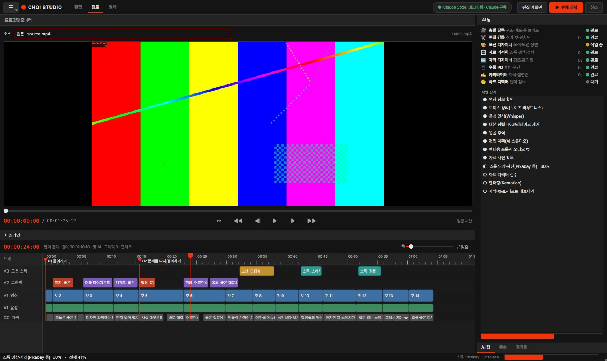
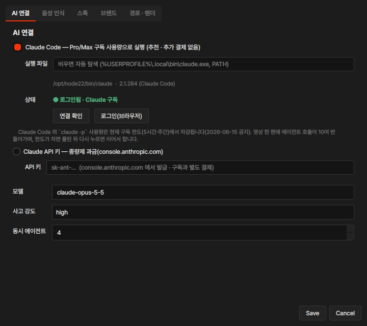

# Choi Studio

### AI 제작팀이 들어 있는 영상 편집 툴 — 원본 영상 하나로 유튜브 롱폼 · 숏폼까지

얼굴이 나오는 강의 영상(토킹헤드)과 대본을 넣으면, **AI 감독과 전문 에이전트 팀**이 컷 편집 · 모션 그래픽 · 스톡 B-roll · 자막 · 숏폼 기획까지 맡아 **완성본을 렌더링**합니다. 오래 걸려도 끝까지 자동입니다.

`Windows 10/11` · `NVIDIA GPU 권장` · `Claude Pro/Max 구독으로 동작(API 결제 불필요)` · `무료 스톡(Pixabay)` · `Premiere Pro XML 내보내기`


---

## 넣는 것 → 나오는 것

| 넣는 것 | 나오는 것 |
|---|---|
| 원본 영상(4K·아이폰 HDR 가능), 별도 녹음(선택) | **롱폼 16:9** 완성본 MP4 |
| 대본(연출 태그 선택) | **숏폼 9:16** 여러 편(후킹 구조 적용) |
| 메모 · 주요 장면 · 편집 지시 | **썸네일 3종**, 자막 **SRT** |
| 제목 · 회차 · 자료 이미지 · BGM · LUT(선택) | **Premiere Pro XML**(원본 참조 컷 + 마커), 업로드 정보(제목 5안·설명란·챕터·태그), 편집 리포트 |

- 편집 톤: **셜록현준**식 교양 토크(일상 → 질문 → 원리 → 개념 명명 → 일상 복귀), 칠판형 사이드 패널 — [리서치](docs/research/셜록현준_편집스타일_리서치.md)
- 비주얼: **Musicbed/Filmsupply 2026 트렌드 리포트**의 에디토리얼 문법(표지형 타이틀, 러닝 헤더, 초대형 타이포, 시그널 레드) — [디자인 시스템](docs/디자인_시스템.md)
- 숏폼: 공개된 후킹·리텐션 연구와 크리에이터 노하우를 규칙으로 — [리서치](docs/research/숏폼_후킹_리서치.md)

---

## 무엇을 해 주나

### 🎬 AI 제작팀 — 감독 한 명 + 전문가 여섯 명 + 아트 디렉터
총괄 감독이 전사본 전체를 읽고 브리프(구조·비트·톤)를 쓰면, 전문 에이전트들이 **동시에** 작업합니다. 렌더가 끝나면 아트 디렉터가 **실제 렌더된 화면을 보고** 고칩니다. → [AI 스튜디오 설명](docs/AI_스튜디오.md)

| | 역할 | 하는 일 |
|---|---|---|
| 🎬 | 총괄 감독 | 챕터 구조, 20~40초마다 연출 비트, 숏폼 아이디어, 자막 톤 |
| ✂️ | 편집 감독 | 추가로 자를 발화, 논점 전환·결론의 펀치인 |
| 🎨 | 모션 디자이너 | 도식 템플릿 배치 + 템플릿으로 안 되는 개념은 **모션 장면을 직접 설계** |
| 🎞 | 자료 리서처 | 무료 스톡 검색어 → 후보 썸네일을 **직접 보고** 선택(틀린 B-roll 보다 없는 게 낫다) |
| 🔤 | 자막 디자이너 | 강조어를 유형별로(전문용어·핵심어·숫자·대비), 자막 프리셋 선택 |
| 📱 | 숏폼 PD | 14가지 훅 유형, 콜드 오픈, 훅 타이틀, 35~50초 구간 |
| ✍️ | 카피라이터 | 유튜브 제목 5안, 설명란, 해시태그, 썸네일 문구, 고정 댓글 |
| 🧐 | 아트 디렉터 | 렌더 스틸 검수 → 글자 줄이기·레이아웃 변경·삭제·모션 장면 재설계 |

### ✂️ 자동 컷 편집
- faster-whisper(large-v3)로 한국어 단어 단위 인식 → **대본 문장으로 자막 교정**
- 같은 구간을 여러 번 말하면 **마지막 테이크만**, "아 다시 할게요" 같은 NG 발화 제거
- 템포 프리셋: 차분하게(0.55초 넘는 쉼만 줄여 '생각하는 호흡' 유지) · 보통 · 빠르게
- 얼굴 추적으로 2캠식 줌 · 펀치인, 9:16 세로 리프레이밍

### 🎨 모션 그래픽 · 템플릿 19종
챕터 카드 · 키워드 슬램 · 용어 정의 · 인용 · 목록 · 단계 프로세스 · 순환 · **더블 다이아몬드** · 2x2 매트릭스 · 비교 · 연표 · 숫자 · 벤 다이어그램 · 피라미드 · 자료 사진 · **모션 장면(AI 직접 설계)** · **스톡 B-roll** · 오프닝 표지 · 로어서드


### 🎞 무료 스톡 영상 · 사진
Pixabay(기본) · Unsplash · Coverr · Pexels 중 키가 있는 곳을 한 번에 검색 → 1080p 로 정리 → 작가 크레딧을 화면 ▣ 와 설명란에 자동 표기. → [스톡 API 가이드](docs/스톡_API_가이드.md)

### 🔤 디자인된 자막
| 롱폼 | 느낌 | 숏폼 | 느낌 |
|---|---|---|---|
| 에디토리얼(기본) | 배경 없는 흰 글자 + 부드러운 그림자, 줄 마스크 리빌 | 키네틱(기본) | 말하는 순간 단어가 마스크 안에서 올라옴 |
| 다큐멘터리 | 왼쪽 정렬 + 강조색 세로 룰(넷플릭스 다큐) | 클린 | 카라오케식(말한 단어만 밝게) |
| 글래스 | 반투명 유리 알약(애플 키노트) | 박스 | 활성 단어 뒤 강조색 알약 |
| 박스 | 잉크 박스 + 강조색 엣지(리포트) | | |

강조: **전문용어** = 형광 마커 · **핵심어** = 밑줄 스윕 · **숫자** = 팝 · **대비** = 외곽선. 한 줄에 하나, 조사는 빼고 어간만, 도식이 떠 있으면 강조를 끕니다. 줄당 16자 · 최대 2줄(넷플릭스 한국어 자막 기준).

---

## 빠른 시작

### 1. 내려받기
- [**ZIP 다운로드**](https://github.com/CHIDdesign/Choi-Explains-Design/archive/refs/heads/claude/gallant-ptolemy-xupm3b.zip) (PR 이 `main` 에 합쳐지면 저장소 첫 화면의 **Code → Download ZIP**)
- `C:\ChoiStudio` 처럼 **공백·한글이 없는 경로**에 압축을 풉니다.

### 2. 설치 — `setup_windows.bat` 더블클릭 (처음 한 번, 20~40분)
관리자 권한도 `winget` 도 필요 없습니다. 없는 것만 공식 배포처에서 받아 설치하고, 중간에 끊겨도 다시 실행하면 이어서 합니다.
**여유 공간**: 설치에 약 7GB, 영상 작업까지 하려면 **20GB 이상**(4K 원본 한 편에 작업 파일 3~5GB). 음성인식 모델·임시 파일·캐시는 C 드라이브 사용자 폴더가 아니라 **프로그램 폴더 안**에 저장되므로, 여유 있는 드라이브에 풀면 됩니다.

| 설치 항목 | 방법 |
|---|---|
| Python 3.12 | python.org 공식 설치 파일(사용자 계정) |
| Node.js LTS · FFmpeg(NVENC 포함) | 이 폴더의 `tools\` 에 휴대용으로 |
| 파이썬 패키지 · GPU 음성인식(cuBLAS·cuDNN) · 렌더러 · 렌더용 Chrome | 가상환경 `.venv` · `renderer\node_modules` |
| **Claude Code** | Anthropic 공식 설치 스크립트 → **브라우저에서 Claude Pro/Max 계정으로 로그인** |
| Whisper large-v3 모델(약 3GB) | 미리 받을지 묻습니다(안 받으면 첫 실행 때) |

### 3. 실행 — `run_studio.bat`
1. **프로젝트** 패널: 제목 입력, 원본 영상을 끌어다 놓기(별도 녹음·자료 이미지·BGM·LUT 는 선택)
2. **스크립트** 패널: 대본 붙여넣기 → [대본 태그 가이드](docs/대본_태그_가이드.md) · 메모 · 편집 지시
3. **인스펙터**: 숏폼 개수 · 해상도 · 자막 스타일 · AI 스튜디오 옵션
4. **편집 계획만** → 타임라인에서 AI 편집을 검토 → **▶ 전체 제작**
5. **결과물** 패널에서 확인, 영상은 더블클릭하면 모니터에서 재생

> **스톡 키(무료)**: ☰ → 도구 → 환경 설정 → 스톡 탭에 **Pixabay API 키**. [pixabay.com/api/docs](https://pixabay.com/api/docs/) 에 로그인하면 문서 안에 키가 보입니다.

---

## 화면 구성

프리미어 프로처럼 **도킹 패널** 구조입니다. 패널은 끌어서 옮기거나 탭으로 합칠 수 있고 배치는 저장됩니다(☰ → 보기 → 레이아웃 초기화).

| 패널 | 내용 |
|---|---|
| **프로젝트** | 시퀀스 정보(제목·회차·시리즈), 미디어 빈(끌어다 놓기), 최근 작업(더블클릭으로 불러오기) |
| **스크립트** | 대본 · 메모/주요 장면 · 편집 지시 |
| **프로그램 모니터** | 원본 · 롱폼 결과 · 숏폼 재생, 타임코드, 프레임 단위 이동(Space 재생) |
| **타임라인** | AI 편집 결과를 트랙으로: V3 모션·스톡 · V2 그래픽 · V1 컷 · A1 음성 · CC 자막 · 챕터 마커. 롱폼 결과와 재생 헤드 연동, Ctrl+휠 확대 |
| **인스펙터** | 출력 · 자막 스타일 · AI 스튜디오 · 오디오/룩(접는 섹션) |
| **AI 팀** | 에이전트별 상태(대기·작업 중·완료) + 작업 단계 진행 |
| **콘솔 · 결과물** | 전체 로그 · 만들어진 파일 목록 |

작업 공간: **편집**(입력·옵션) · **검토**(모니터·타임라인 크게) · **결과**(결과물·AI 팀·콘솔)



---

## AI 연결 — Claude Pro/Max 구독으로 (API 결제 불필요)

기본값은 **이 PC 의 Claude Code** 로 AI 를 부르는 방식입니다. Claude Code 의 `claude -p` 사용량은 현재 **구독 한도(5시간·주간)에서 차감**되므로 API 를 따로 결제하지 않아도 됩니다([Anthropic 공지, 2026-06-15](https://support.claude.com/en/articles/15036540-use-the-claude-agent-sdk-with-your-claude-plan)).



- **로그인**: 설치 중 자동으로 안내합니다. 나중에는 ☰ → 도구 → **Claude 로그인(구독 계정)**. 헤더 오른쪽 칩에 `● Claude Code · 로그인됨` 이 보이면 준비 완료.
- **사용량**: 영상 한 편에 에이전트 호출이 10여 번입니다. 한도가 차면 풀린 뒤 **전체 제작**을 다시 누르면 끝난 단계는 건너뜁니다.
- **API 결제로 새지 않게**: 실행할 때 `ANTHROPIC_API_KEY` 환경변수를 빼고 Claude Code 를 부릅니다.
- **API 키 방식**: 환경 설정 → AI 연결 → *Claude API 키* 를 고르면 종량제로 동작합니다(구독과 별도 결제).
- AI 없이도: 대본 태그 기반 규칙 편집으로 완성본까지 만듭니다.

---

## 시간과 사용량

- 15분 원본(4K) 기준 대략: 음성 인식 3~6분(RTX 계열) · 프록시 2~4분(NVENC) · AI 계획 수 분 · 렌더 10~25분(롱폼) + 숏폼·썸네일 몇 분.
- AI 스튜디오: 감독 1회 + 전문가 6회(병렬) + 스톡 선택 1회 + 검수 1~2회(+모션 수정). 에이전트별 사용량은 편집 리포트에 표로 남습니다.
  - 가볍게 쓰려면 인스펙터에서 **멀티 에이전트**를 끄세요(Claude 두 번 호출로 계획).
- 스톡 API 는 모두 무료(Pixabay 60초당 100회, Unsplash·Coverr 데모 시간당 50회; 검색 결과는 캐시).

---

## 자주 묻는 질문

**다운로드한 파일이 1~2MB 밖에 안 돼요.**
GitHub 에서 받는 것은 프로그램의 설계도(소스 코드)입니다. 무거운 부품은 설치할 때 각 공식 배포처에서 받습니다: Whisper 모델 약 3GB, GPU 라이브러리 약 1.5GB, 파이썬 패키지 약 0.6GB, 렌더러+Chrome 약 0.5GB, FFmpeg·Node.js·Python 약 0.3GB. 설치 후 폴더는 **5~6GB** 입니다.

**Claude Max 를 쓰는데 API 를 또 결제해야 하나요?**
아니요. 기본 연결이 Claude Code(구독)입니다. 구독과 API 는 별개 상품이라 API 키 방식을 고를 때만 따로 결제합니다([도움말](https://support.claude.com/en/articles/9876003-i-have-a-paid-claude-subscription-pro-max-team-or-enterprise-plans-why-do-i-have-to-pay-separately-to-use-the-claude-api-and-console)).

**GPU 가 없어도 되나요?**
됩니다. 음성 인식과 인코딩이 CPU 로 바뀌어 느려질 뿐입니다.

**AI 편집을 사람이 고칠 수 있나요?**
**편집 계획만** → 타임라인 검토 → ☰ → 파일 → 편집 계획 열기(plan.json)에서 문구·챕터·훅 타이틀을 고친 뒤 **전체 제작**. 음성 인식·프록시는 캐시를 쓰고 고친 계획으로 다시 렌더합니다. 최종 손질은 Premiere Pro XML 로.

---

## 문제 해결

| 증상 | 해결 |
|---|---|
| 설치 창에 `'winget' is not recognized` | 예전 설치 파일입니다. 최신 ZIP 을 다시 받으세요(지금 버전은 winget 을 쓰지 않습니다) |
| 설치 중 다운로드 실패 | 학교·회사망은 막힐 수 있습니다. 다른 네트워크에서 다시 실행하면 이어서 설치합니다 |
| 설치 중 `No space left on device` · `ENOSPC` · `not enough space` | **디스크 공간 부족**입니다. 설치에 7GB, 영상 작업까지 20GB 이상 필요합니다. 휴지통·다운로드 폴더·디스크 정리로 공간을 비우거나, 여유 있는 드라이브(예: `D:\ChoiStudio`)로 폴더를 옮겨 다시 실행하세요. 음성인식 모델·임시 파일·캐시는 모두 프로그램 폴더 안에 저장됩니다 |
| 헤더에 `○ Claude Code · 로그인 필요` | ☰ → 도구 → Claude 로그인(구독 계정) |
| `Claude 구독 사용량 한도에 도달` | 한도가 풀린 뒤 전체 제작을 다시 누르면 끝난 단계는 건너뜁니다. 인스펙터에서 멀티 에이전트를 끄면 사용량이 줄어듭니다 |
| `cublas64_12.dll` / `cudnn` 오류 | `setup_windows.bat` 재실행, 또는 환경 설정 → 음성 인식 → 장치 `cpu` |
| `ffmpeg 를 찾을 수 없습니다` | `setup_windows.bat` 재실행(`tools\ffmpeg` 에 자동 설치) |
| 렌더 중 Chrome 오류 | `renderer` 폴더에서 `npx remotion browser ensure` |
| 아이폰 HDR 색이 이상함 | 자동 톤매핑(HLG/PQ → SDR). 그래도 이상하면 LUT 지정 |
| 자막 용어가 계속 틀림 | 환경 설정 → 음성 인식 → 용어 사전에 `틀린말=맞는말`, 또는 대본을 넣기 |
| 스톡 B-roll 이 안 들어감 | 환경 설정 → 스톡에 Pixabay 키 확인. 맞는 후보가 없으면 일부러 넣지 않습니다 |

---

## 작동 구조

```
원본 영상 ─┬─ FFmpeg: 보이스 정리/싱크 ── faster-whisper(단어 타임스탬프) ── 대본 정렬(NG·리테이크 제거, 태그 고정)
          ├─ YuNet 얼굴 추적                                                │
          └─ FFmpeg(NVENC): CFR 프록시                                       ▼
                         🎬 AI 스튜디오(Claude Code 구독 / API): 감독 브리프 → 전문가 6명 병렬 → 편집 계획
                                          │                              │
                   🎞 무료 스톡 검색·비전 선택·다운로드            🧐 렌더 스틸 검수 → 수정
                                          ▼
                 Remotion(React) 렌더: 프레임 단위 컷 + 카메라 + 템플릿·모션 장면 + 자막 + 오디오
                                          ▼
                  MP4 · 썸네일 · SRT · Premiere XML · 업로드 정보 · 편집 리포트
```

- 영상 컷은 Remotion 이 CFR 프록시에서 **프레임 단위로**, 음성은 **샘플 단위로** 잘라 붙여 싱크가 누적해 밀리지 않습니다.
- 단계별 결과는 `projects/…/work/` 에 캐시되어 다시 실행하면 바뀐 단계부터 진행합니다.

| 폴더 | 내용 |
|---|---|
| `studio/` | 파이썬 파이프라인·편집 툴 화면(`python -m studio`) |
| `studio/gui/` | 도킹 패널 UI: 테마 · 타임라인 · 프로그램 모니터 · 패널 · 환경 설정 |
| `studio/agents/` | 🎬 AI 스튜디오(감독 → 병렬 전문가 → 합치기, 스톡 선택, 아트 디렉터 검수) |
| `studio/director/` | Claude 호출(`claude_code.py` 구독 / `claude.py` API), 스키마, 규칙 기반 디렉터, 템플릿 카탈로그 |
| `studio/stock/` | 스톡 클라이언트(Pixabay·Unsplash·Coverr·Pexels), 통합 검색, 후보 시트·선택·다운로드 |
| `studio/motion/` | 모션 DSL 검증기 |
| `prompts/` | 스튜디오 헌장·에이전트 지시문·스타일/후킹 가이드·모션 DSL·디자인 스킬 노트 — 채널 톤은 여기서 |
| `renderer/` | Remotion 프로젝트(디자인 시스템·템플릿·자막 프리셋·모션 장면) |
| `.claude/skills/` | 포함한 오픈소스 디자인 스킬(MIT) — [스킬 출처](docs/스킬_출처.md) |
| `scripts/` | 설치 도우미(winget 없이 Node.js·FFmpeg·Python 설치) |
| `docs/` | 사용 가이드, 디자인 시스템, 리서치(숏폼 후킹 · 셜록현준 · MCP · 자막/모션 스킬 · Claude 영상 자동화) |
| `tests/` | 단위 테스트, GPU·네트워크 없이 도는 E2E |

---

## 라이선스 · 출처

- **Remotion** 은 개인·3인 이하 회사는 무료, 그 이상은 회사 라이선스가 필요합니다(remotion.dev/license).
- 폰트: Pretendard, Anton, Noto Serif KR — SIL Open Font License. 얼굴 검출: OpenCV Zoo YuNet — MIT.
- 위키미디어 사진은 CC0/퍼블릭 도메인/CC BY/CC BY-SA 만 쓰고 화면과 설명란에 출처를 넣습니다.
- 스톡은 각 제공처 라이선스를 따릅니다(Pixabay·Unsplash·Pexels 상업적 이용 가능, Unsplash·Coverr 출처 필수, Coverr 는 상업 이용 문구가 문서마다 달라 직접 확인). 인물·상표가 크게 나오는 컷은 업로드 전에 직접 확인하세요.
- `.claude/skills/` 의 스킬은 각 폴더의 MIT 라이선스를 따릅니다.
- **BGM 은 직접 라이선스를 받은 곡**을 넣어야 합니다(Musicbed, Artlist, YouTube 오디오 보관함 등).

## 개발

```bash
python -m pytest tests -q                              # 단위 테스트(UI 스모크 포함)
python tests/e2e_synthetic.py --browser <chrome>       # 합성 영상으로 전체 파이프라인(규칙 기반)
python tests/e2e_studio.py --browser <chrome>          # 가짜 Claude Code CLI·스톡 서버로 AI 스튜디오 전체
python tests/e2e_studio.py --backend api --browser <chrome>   # 같은 흐름을 가짜 API 서버로
cd renderer && npm run studio                          # 템플릿 디자인 미리보기(src/samples.ts)
python -m studio run --video a.mp4 --title "제목" --script 대본.txt --notes 메모.txt   # CLI
```
