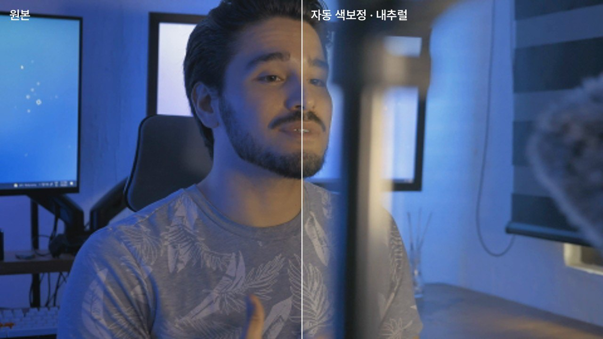

# Choi Studio

### 주제 · 원본 영상 · 대본 — 세 가지만 넣으면 유튜브 롱폼 1편 + 숏폼 2편이 완성됩니다

디자인 이론 교육 채널을 위한 **영상 제작 오토파일럿**입니다. 대본을 말하는 모습을 찍은 긴 원본을 넣으면, 사람이 후반 작업을 하지 않아도 되는 수준까지 끝냅니다.

AI 제작팀(Claude)이 기획하고, 편집 문법 엔진이 편집 기술을 입힙니다. 편집 문법은 셜록현준·지식 채널·리텐션 편집 가이드를 연구해서 정리한 것입니다. 그다음 색보정·음향 마스터링·렌더링까지 자동으로 이어집니다.


---

## 넣는 것 → 나오는 것

| 넣는 것(세 가지) | 나오는 것(`projects/<작업>/output/`) |
|---|---|
| ① **주제**: 무엇을·누구에게·왜(두세 줄) | `1_롱폼_<제목>.mp4`: 16:9, 색보정·자막·모션그래픽·효과음·음악, -14 LUFS 마스터 |
| ② **원본 영상**: 대본을 말하는 긴 원본 그대로. 다시 말한 것·NG 포함 | `2_숏폼1_….mp4` · `3_숏폼2_….mp4`: 9:16, 셜록현준식 레터박스, 서로 다른 훅 |
| ③ **대본**: 붙여넣기 또는 .txt · .md · .docx · .hwpx | `업로드정보.txt`: 제목 후보 · 설명란(챕터 타임코드) · 태그 · 고정 댓글 · 숏폼 캡션 |
| | `부가자료/`: 썸네일 3장 · 자막(.srt) · 색보정 전후 · 편집 리포트 · Premiere XML |

설정할 것은 없습니다. 제목, 구성, 얼굴을 보여줄 곳과 그래픽을 띄울 곳, 강조, 음악, 숏폼 구간은 전부 AI 팀과 엔진이 정합니다.

---

## 무엇을 자동으로 하나

### 1. 가장 또렷한 테이크만 남깁니다
같은 문장을 여러 번 말했으면 테이크마다 아래 항목을 점수로 매겨 **가장 또렷한 테이크**를 씁니다. 마지막 테이크를 무조건 쓰지 않습니다.
- 대본과 얼마나 일치하는지
- 끝까지 말했는지
- 발음이 얼마나 또렷한지(음성 인식 확신도)
- 추임새·말더듬이 있는지
- 말하는 속도와 음량

"다시 할게요" 같은 NG 발화와 긴 머뭇거림도 잘라냅니다.

### 2. 🎬 AI 제작팀이 기획합니다(Claude Pro/Max 구독)
총괄 감독이 브리프를 쓰면 전문가 여섯 명이 동시에 일합니다.

| 역할 | 하는 일 |
|---|---|
| 🎬 총괄 감독 | 제목 · 구성(챕터) · 문장마다 **얼굴을 보여줄지, 목소리만 두고 그래픽을 띄울지** · 음악 무드 |
| ✂️ 편집 감독 | 강조 순간(펀치라인·반전·결론)과 **화자 옆에 띄울 2줄 콜아웃 문구** |
| 🎨 모션 디자이너 | 도식 템플릿 + 직접 설계한 모션 장면 |
| 🎞 자료 리서처 | B-roll 을 검색하고 후보 사진을 **눈으로 보고** 고름 |
| 🔤 자막 디자이너 | 용어·핵심어·숫자 강조 |
| 📱 숏폼 PD | 원본에서 60초 이상 떨어진 두 구간을 서로 다른 훅으로(통찰형 1 · 티저형 1) |
| ✍️ 카피라이터 | 제목 · 설명란 · 태그 · 썸네일 문구 |
| 🎨 컬러리스트 | 룩 4종 비교 시트를 보고 톤 선택 |
| 🧐 아트 디렉터 | 렌더된 화면을 보고 검수 · 수정 지시 |

### 3. 편집 문법 엔진이 편집 기술을 입힙니다
[레퍼런스 연구](docs/research/)에서 나온 수치를 그대로 씁니다. 셜록현준 스토리보드 실측, MrBeast 제작 가이드, Galloway 쇼츠 5,400편 분석 등이 근거입니다.

- **점프컷 앵글**: 컷마다 와이드 100% ↔ 미디엄 112%를 교차합니다(5~8초마다, 2캠처럼). 긴 샷은 초당 0.5%씩 느리게 푸시인합니다.
- **펀치인**: 강조 순간 +15~20% 하드컷을 1~4초 유지합니다. 분당 0.75회 정도입니다.
- **키워드 콜아웃**(셜록현준식): 화자 반대편 빈 공간에 굵은 2줄과 맥락 라벨을 띄웁니다.
- **장면 전환**: 하드컷이 90% 이상입니다. 챕터 카드 진입은 브랜드 컬러 와이프, 타이틀은 빛샘을 씁니다. 그 밖의 전환은 1분에 한 번 이하로 블러·줌스루·휩을 씁니다. 모든 전환은 컷 지점 중심 오버레이라 **싱크가 밀리지 않습니다**.
- **얼굴 ↔ 목소리+화면**: 얼굴 약 50%, B-roll 30%, 그래픽 13%(셜록형)가 목표입니다. 결론·감정은 얼굴로, 추상 개념은 모션그래픽으로, 고유명사는 1초 안에 사진으로 보여줍니다.
- **숏폼**: 셜록현준식 레터박스입니다. 상단 2줄 제목(2줄째 강조색), 가운데 정사각형 창, 창 안 검정 박스 자막(강조어 노랑)으로 구성합니다. 2~2.5초마다 점프 줌을 넣고, 콜드 오픈 뒤에는 블러로 되감습니다.

### 4. 색보정
프레임을 분석해 화이트밸런스, 노출(피부 60~70 IRE), 명암 범위, 채도를 교정합니다. 파란 모니터 조명 같은 분위기 조명은 살리고 과보정은 막습니다.

룩은 네 가지(내추럴 · 웜 필름 · 클린 브라이트 · 시네마틱)입니다. 🎨 컬러리스트가 비교 시트를 보고 고르고, 결과는 3D LUT 로 구워 롱폼·숏폼·썸네일에 똑같이 들어갑니다.



### 5. 소리
- **목소리**: 신경망 잡음 제거(RNNoise) → 80Hz 하이패스 → 박스감 정리 → 존재감·공기감 → 디에서 → 컴프레서 3:1 순서로 다듬습니다.
- **효과음**: Pixabay·Mixkit 에서 고른 실제 효과음 54개를 씁니다(처음 실행할 때 내려받음).
  - 전환 whoosh 는 피크를 컷 첫 프레임에 맞춥니다.
  - 그래픽이 나올 때 swoosh, 목록 항목마다 click, 챕터 전에 riser, 가장 큰 순간에 저음 임팩트를 넣습니다.
  - 분당 2개 정도이고, 결론·감정 문장 밑에는 넣지 않습니다.
- **배경음악**: Pixabay 등의 곡 12개에서 무드에 맞춰 고릅니다.
  - 목소리가 나오면 20LU 아래로 자동 덕킹합니다.
  - 챕터마다 같은 계열의 다른 곡으로 크로스페이드합니다.
  - 핵심 문장 0.8초 전에는 음악을 비웁니다.
- **마스터링**: 2-pass 로 **-14 LUFS · -1 dBTP**(유튜브 기준)에 맞춥니다.

---

## 빠른 시작

### 1. 내려받기
초록색 **Code** 버튼 → **Download ZIP** 을 누르고, 압축을 여유 있는 드라이브에 풉니다(예: `D:\ChoiStudio`, 20GB 이상 권장).

### 2. 설치: `setup_windows.bat` 더블클릭(처음 한 번, 20~40분)
**관리자 권한으로 자동 실행**됩니다. '사용자 계정 컨트롤' 창이 뜨면 **예**를 누르세요. winget 은 필요 없습니다.

설치 과정:
- Python · Node.js · FFmpeg(NVENC) · CUDA 음성인식 라이브러리 · 렌더러 · Claude Code 설치
- Claude 로그인(Pro/Max 구독 계정)
- 효과음·음악 내려받기
- (선택) Pixabay 키 입력: 스톡 '영상' B-roll 용. 없어도 사진 B-roll 은 키 없이 됩니다
- 바탕화면에 **Choi Studio** 아이콘 만들기

### 3. 실행: 바탕화면 **Choi Studio**(또는 `run_studio.bat`)
세 칸을 채우고 **영상 만들기 ▶** 를 누르면 됩니다.

- 영상은 칸을 눌러 고르거나, 탐색기에서 끌어다 놓거나, 파일을 복사한 뒤 **Ctrl+V** 로 넣습니다.
- 진행 화면에서 단계별 체크리스트와 AI 팀 작업 기록을 볼 수 있습니다.
- 끝나면 결과 화면에서 바로 재생하거나 폴더를 엽니다.


- 중간에 멈추거나 오류가 나도 **최근 작업 → 이어서 만들기**를 누르면 끝난 단계는 건너뜁니다.

---

## AI 연결: Claude Pro/Max 구독으로(API 결제 불필요)

이 PC 의 **Claude Code** 로 AI 를 부릅니다. `claude -p` 사용량은 **구독 한도(5시간·주간)에서 차감**되므로 API 를 따로 결제하지 않습니다([Anthropic 공지](https://support.claude.com/en/articles/15036540-use-the-claude-agent-sdk-with-your-claude-plan)).

- 헤더 오른쪽 칩에 `● Claude Code · 로그인됨` 이 보이면 준비 완료입니다. `○` 이면 칩을 눌러 로그인하세요.
- 영상 한 편에 에이전트 호출은 12~15번입니다(감독, 전문가 6명, 컬러리스트, 자료 선택, 검수 1~2회).
- 실행할 때 `ANTHROPIC_API_KEY` 를 빼고 부르므로 API 로 과금되지 않습니다.
- AI 가 없을 때는 대본 태그 기반 규칙 편집으로 완성본까지 만듭니다(품질은 AI 팀보다 낮음).

---

## 시간

15분 원본(4K, RTX GPU) 기준 대략 이렇습니다.

| 단계 | 시간 |
|---|---|
| 음성 인식 | 3~6분 |
| 색보정·편집본(NVENC) | 2~4분 |
| AI 기획 | 3~8분 |
| 렌더(롱폼) | 10~25분 |
| 숏폼 2편 | 3~6분 |
| 음향 마스터링 | 1분 |

---

## 자주 묻는 질문

**설정을 바꾸고 싶어요.**
기본값 그대로 쓰도록 만들었습니다. 꼭 필요할 때만 오른쪽 위 ⚙(고급 설정)을 쓰세요. AI 연결, 스톡 키, 브랜드 색·이름, 저장 경로를 바꿀 수 있습니다.

**왜 관리자 권한으로 실행되나요?**
설치 중 쓰기 권한 문제(ENOSPC·not enough space 등)를 피하기 위해서입니다. 모든 실행 파일이 스스로 관리자 권한으로 다시 열립니다. 관리자 창에서도 탐색기 끌어다 놓기가 되도록 처리했습니다.

**다운로드한 파일이 작아요.**
GitHub 에는 프로그램 설계도만 있습니다. 무거운 부품은 설치할 때 받습니다(Whisper 모델 3GB, GPU 라이브러리 1.5GB, 렌더러 0.5GB, 효과음·음악 80MB 등). 설치가 끝나면 폴더는 약 6GB 입니다.

**GPU 가 없어도 되나요?**
됩니다. 음성 인식과 인코딩이 느려질 뿐입니다.

**결과를 조금 고치고 싶어요.**
`부가자료/롱폼_premiere.xml` 을 프리미어에서 열면 컷이 그대로 들어옵니다. 기획을 고쳐 다시 만들려면 `부가자료/plan.json` 을 참고하세요.

---

## 문제 해결

| 증상 | 해결 |
|---|---|
| 설치 창이 바로 닫힘 · 권한 오류 | 'UAC(사용자 계정 컨트롤)' 창에서 **예**를 눌렀는지 확인하세요. 파일을 오른쪽 클릭 → 관리자 권한으로 실행해도 됩니다 |
| `No space left on device` · `ENOSPC` · `not enough space` | 설치 시작 때 표에 드라이브별 **쓰기 테스트** 결과가 나옵니다. `WRITE FAILED` 인 곳이 원인입니다. 폴더를 여유 있는 드라이브(예: `D:\ChoiStudio`)로 옮겨 다시 실행하세요 |
| 헤더에 `○ Claude Code · 로그인 필요` | 칩을 누르면 로그인 창이 열립니다 |
| `Claude 구독 사용량 한도에 도달` | 한도가 풀린 뒤 **최근 작업 → 이어서 만들기** |
| `cublas64_12.dll` / `cudnn` 오류 | `setup_windows.bat` 을 다시 실행하거나 ⚙ → 음성 인식 → 장치 `cpu` |
| 효과음·음악이 기본음으로 나옴 | 인터넷이 막혀 내려받지 못한 것입니다. 다른 네트워크에서 `setup_windows.bat` 을 다시 실행하세요 |
| 아이폰 HDR 색 | 자동 톤매핑(HLG/PQ → SDR) 뒤 색보정합니다 |
| 자막 용어가 계속 틀림 | 대본을 넣으면 대본 표기로 교정됩니다. ⚙ → 음성 인식 → 용어 사전 |

---

## 작동 구조

```
주제 · 원본 영상 · 대본
   │
   ├─ 목소리: RNNoise 잡음 제거 · EQ · 컴프 ── Whisper(단어 시각) ── 대본 정렬 · 가장 또렷한 테이크 · NG 제거
   ├─ 얼굴 추적(YuNet) ── 자동 색보정(분석 → 교정 + 룩 → 🎨 컬러리스트 → 3D LUT)
   │
   ├─ 🎬 AI 제작팀(Claude Code 구독): 감독 브리프 → 전문가 6명 병렬 → 편집 계획(얼굴/그래픽 배분 · 강조 순간 · 콜아웃 · 숏폼 2편)
   │         └─ 🎞 스톡 검색·비전 선택 · 🧐 렌더 스틸 검수 → 수정
   │
   ├─ 편집 문법 엔진: 점프컷 앵글 · 펀치인 · 콜아웃 · 전환 · 효과음 큐 · 음악 스웰/교체/비우기
   ├─ Remotion(React) 무음 렌더: 프레임 단위 컷 + 카메라 + 모션그래픽 + 자막 + 전환
   └─ FFmpeg 음향: 목소리 + 덕킹 음악 + 효과음 → -14 LUFS 마스터 → 영상과 합치기
```

| 폴더 | 내용 |
|---|---|
| `studio/` | 파이프라인(`python -m studio`) |
| `studio/gui/` | 오토파일럿 창(세 입력 → 진행 → 결과), 관리자 창 끌어다 놓기 |
| `studio/edit/grammar.py` | 편집 문법 엔진(모든 수치는 `PARAMS` 한 곳) |
| `studio/grade/` | 자동 색보정 |
| `studio/sound/` · `studio/media/mix.py` | 효과음·음악 라이브러리, 믹스·마스터링 |
| `studio/agents/` · `studio/director/` | AI 제작팀, Claude 연결(구독/API), 규칙 기반 디렉터 |
| `studio/stock/` | 스톡(Pixabay·Unsplash·Coverr·Pexels + 키 없는 Openverse) |
| `prompts/` | 팀 헌장 · 에이전트 지시문 · **편집 플레이북**(`prompts/playbook/`) |
| `renderer/` | Remotion 프로젝트(디자인 시스템 · 템플릿 · 자막 · 콜아웃 · 전환) |
| `assets/sound_manifest.json` | 효과음·음악·잡음 제거 모델 목록(파일은 처음 실행 때 받음) |
| `docs/research/` | 레퍼런스 연구: 롱폼 편집 문법 · 숏폼 훅·전환 · 레퍼런스 영상 분석 · 셜록현준 |

---

## 라이선스 · 출처

- **Remotion** 은 개인·3인 이하 회사는 무료입니다(remotion.dev/license).
- 폰트: Pretendard, Anton, Noto Serif KR(SIL OFL). 얼굴 검출: YuNet(MIT). 잡음 제거 모델: Xiph RNNoise(BSD).
- 효과음·음악: Pixabay · Mixkit · Freesound · Incompetech. 개인 영상 제작용으로 처음 실행할 때 원 배포처에서 내려받으며, 저장소에는 포함하지 않습니다. 업로드 정보에 배경음악 곡명을 적어 둡니다.
- 스톡·자료 사진: 각 제공처 라이선스를 따르고 출처를 설명란에 자동으로 적습니다.

## 개발

```bash
python -m pytest tests -q                                          # 단위 테스트(엔진·색보정·믹스·UI)
cd renderer && npx tsc --noEmit                                    # 렌더러 타입 검사
python tests/e2e_synthetic.py --browser <chrome> --face 얼굴.mp4    # AI 없이 전체 파이프라인
python tests/e2e_studio.py --browser <chrome>                      # 가짜 Claude Code·스톡으로 AI 팀 전체
python -m studio run --video 원본.mp4 --topic "주제" --script 대본.txt   # 창 없이
```
