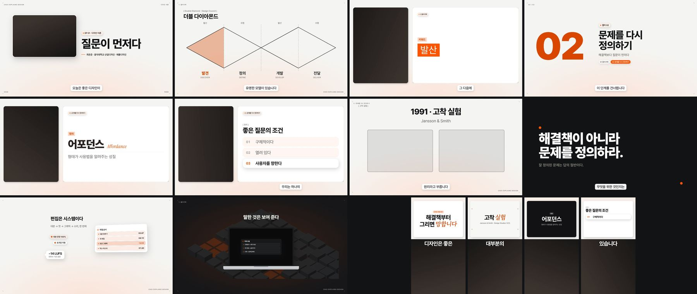

<div align="center">


# Choi Studio

**토킹헤드 원본 + 대본 → 유튜브 롱폼 1편 + 숏폼 1~2편. Claude 가 총괄하는 Windows 데스크톱 오토파일럿.**

[](#빠른-시작)
[](#빠른-시작)
[](https://www.remotion.dev)
[](#ai-연결과-비용)

[무엇을 만드나](#무엇을-만드나) · [화면 디자인](#화면-디자인--모던-모션) · [서체](#서체) · [작동 방식](#작동-방식) · [편집 원칙](#편집-원칙) · [빠른 시작](#빠른-시작) · [AI 연결](#ai-연결과-비용) · [FAQ](#자주-묻는-질문)

</div>

<br>

<p align="center">
  
</p>

## 무엇을 만드나

디자인 이론 교육 채널용으로 만든 개인 편집 도구입니다. **세 가지만 넣습니다.**

| 넣는 것 | 나오는 것 |
|---|---|
| **① 주제 설명** — 무엇을, 누구에게, 왜 | **롱폼 1편** — 16:9 · 1080p · −14 LUFS · 오프닝 하이라이트(≤20초) → 처음부터 |
| **② 원본 영상** — NG·다시 말한 부분이 섞인 그대로. 여러 각도·여러 파일 가능 | **숏폼 1~2편** — 9:16 전용 구성. 제대로 된 한 편이 우선, 둘째는 다른 아이디어로 확실할 때만 |
| **③ 대본** — 붙여넣기 또는 `.txt` `.docx` `.hwpx` | **부가 자료** — 썸네일 3장 · 자막(SRT) · 업로드 정보 · 편집 리포트 · 검토 시트 · 조사 노트 · 자료 대장 · Premiere XML |

**Claude 가 메인 에이전트입니다.** 주제를 웹에서 조사하고, 대본 흐름대로 구성과 레이아웃을 기획하고, 자료를 찾아 쓰고, 무엇을 남기고 자를지(컷)를 직접 결정합니다. 규칙과 외부 프로그램은 음성 인식·얼굴 추적·인코딩 같은 **말단 기계 작업**만 맡습니다. 설정할 것은 없습니다 — 화면 구성, 강조, 음악, 숏폼 구간, 앵글은 모두 자동으로 정합니다.

<br>

## 화면 디자인 — 모던 모션

<p align="center">
  
</p>
<p align="center"><sub>디자인 v4 스틸(화자는 자리 표시). 1·2행 롱폼: 타이틀 · 도식 · 키워드 · 챕터 카드 · 정의 · 목록 · 모션 장면 · 어두운 카드. 3행: UI 패널·칩·말풍선 장면 · 아이소메트릭 블록 + 노트북 목업 · 숏폼 카드 셋</sub></p>

테크 설명 영상의 모션 디자인 언어를 교육 영상에 맞게 옮긴 룩입니다(`docs/디자인_v4_모던모션.md`). **원칙은 셋** — 무대 둘, 색 하나, 글자 한 가족.

| | |
|---|---|
| **무대 둘** | 밝은 무대(흰 `#F7F8F6` + 아래쪽 옅은 디자인 색 번짐)가 기본. 어두운 무대(차콜 `#121214`)는 한 방·반전·큰 숫자에만, 챕터당 한 번 안팎 |
| **색 하나** | 채널 오렌지 `#FC5400`(흰 바탕 글자는 짙은 톤, 칩·행·형광은 옅은 톤). 한 화면에 강조색 자리는 한 곳 |
| **그림자** | 광원 하나(위에서), 넓게 번지는 부드러운 그림자 3단. 종이 질감·필름 입자·찢긴 테두리 없음 |

### 부품

| 부품 | 하는 일 |
|---|---|
| **키네틱 헤드라인** | 어절마다 아래에서 올라오며 등장, 자간 좁힌 굵은 산세리프. **한 어절만** 이탤릭 세리프 강조. 짧은 문장은 둘레에 흐린 메아리, 제목 둘레 코너 마크 넷 |
| **UI 패널** | 흰 둥근 카드 + 제목 줄 + 둥근 행(아이콘 · 라벨 · 값), 살짝 기운 3D 틸트. 행마다 3프레임 간격으로 들어옴 |
| **칩 · 말풍선** | '✓ 라벨' 알약(정착 곡선으로 튀어나옴) · 값 + 작은 설명 + 꼬리 |
| **기기 목업** | 모니터·노트북·폰 틀 안에 화면(UI 재현·지도·그래프·행) |
| **아이소메트릭 블록** | 흰 블록 도시 + 옅은 색 길. 장소·도시·흐름을 말할 때의 바탕 — 내용과 무관한 장식으로는 쓰지 않음(아트 디렉터가 뺌) |
| **큰 숫자** | Pretendard 900, 구두점만 디자인 색(`02:47`), 챕터 번호·카운터 |
| **영상 위 글자** | 가는 머리말 + 굵은 본문. 사진을 분석해 피사체 반대쪽 빈 쪽에 놓고 그쪽만 어둡게 |
| **오린 사진 장면** | 밝은 무대 가운데 오린 사물(바닥 그림자) + 칩 + 헤드라인 |
| **챕터 카드 · 타이틀 · 엔드카드** | 거대 번호 + 제목 + 주장 한 줄 + 목차 칩 / 제목 + 화자 둥근 카드 / '다음 이야기에서' + 흰 카드 셋 |
| **자막** | 흰 둥근 상자 + 부드러운 그림자, Pretendard 500 · 38px, 핵심어 짙은 오렌지. 한두 마디씩 구(句) 단위 |

### 화면 구성 — 얼굴보다 시청각 자료

채널 주인의 주문: *"모션 그래픽과 스톡 이미지·영상을 최대한 많이. 내 얼굴이 늘 나올 필요는 없다."*

- 배분표(본편 기준): **얼굴만 ≤ 20%** · **실물 자료(스톡 영상·사진·문서·UI 재현) ≥ 45%** · **모션 장면·카드·도식 ≥ 30%**. 얼굴 없는 구간은 90초까지, 맨얼굴은 한 번에 25초 이하.
- 개념 설명의 기본 화면은 **모션 그래픽만의 전체 화면**(얼굴 없이). 대상·사례·장소·과정·수치가 나오면 스톡 영상·사진을 **전면**으로. 지나가는 언급은 얼굴 옆 흰 카드(pip), 화자 표정이 필요한 순간만 split.
- 얼굴은 훅·의견·결론·감정 문장에서 — 그때는 그래픽으로 가리지 않습니다(홀드).
- **사진 위 그래픽은 사진을 분석한 뒤 놓습니다**(`studio/vision/compose.py`): 얼굴 상자 + 3×3 복잡도·밝기로 글자를 놓을 빈 쪽을 정하고, 인물 사진은 **얼굴이 잘리지 않게** 초점을 옮기거나 통째로 보입니다. 아트 디렉터가 렌더된 화면에서 다시 확인합니다.
- 모션 장면은 렌더 전에 린트 L01~L28(0.5초 무대 · 읽는 시간 · 말보다 늦음 · 글자 크기 · 요소 겹침 · 자막 자리)을 통과해야 하고, 틀리면 모션 디자이너가 한 번 고칩니다.

### 서체

거의 모두 **Pretendard** 한 가족입니다 — 헤드라인 800(자간 −0.035em) · 본문 500 · 라벨 600 대문자(자간 0.14em) · 큰 숫자 900. 영문·숫자·연도와 헤드라인의 강조 어절 하나만 **Instrument Serif 이탤릭**(한글 강조 어절은 번들 고운바탕 700 + 기울임 합성). 한 화면에 세 가족까지. 모두 OFL 서체이며 설치 때 번들됩니다. v3 종이 콜라주의 명조·손글씨·블랙한산스는 번들에 남아 있지만 기본 룩에서는 쓰지 않습니다.

### 숏폼 — 릴스식

위 큰 카드 · 아래 얼굴 · 이음새에 한두 마디 굵은 자막. 카드는 **흰 UI 카드(알약 라벨 + 이탤릭 세리프 강조 어절) · 밝은 무대 + 코너 마크 · 어두운 카드**를 번갈아 쓰고, 사진이 있으면 첫 2.2초는 부채꼴 카드 + 큰 제목. 롱폼의 모션 장면·자유 카드는 줄여 넣지 않고 숏폼 개념 카드로 다시 짭니다. 첫 3초는 훅입니다.

<br>

## 작동 방식

<p align="center">
  
</p>

단계마다 결과를 저장하므로 중간에 멈춰도 다시 실행하면 끝난 단계는 건너뜁니다. **서로 기다릴 필요가 없는 일은 동시에 합니다.**

```
영상 확인 → [목소리 → 음성 인식 ∥ 얼굴 추적 ∥ 🔎 주제 조사(웹)] → 대본 맞추기 + ✂️ 컷 편집 총괄
          → [🎬 기획(트리트먼트 · 🛠 시그니처 장면 · 전문가 여섯) ∥ 색보정 → 편집본 인코딩] → 컷 → 🚦 게이트 A
          → [편집 오류 검사 ∥ 자료 조달 → 스톡 ∥ 효과음 · 렌더 준비] → [🧐 아트 디렉터 검수 ∥ 🎼 음악 큐 시트]
          → 렌더(그동안 음향 믹스) → 영상과 합치기 → 검토 시트 · 🧐 타임라인 검수 · 마무리
```

| 단계 | 하는 일 |
|---|---|
| **01 분석** | 원본이 여러 개면 소리로 싱크를 맞춰 다시점/나눠 찍기를 가림 · 목소리를 재서 **필요한 만큼만** 보정 · Whisper 단어 단위 인식(배치 추론) + VAD 쉼 · 얼굴 추적 · 자동 색보정(스코프 판정 → 벗어난 것만, 정상이면 원본 그대로). 그동안 **🔎 리서치 디렉터**가 대본·주제로 웹을 조사해 사실·출처·확인한 공용 이미지·재현 사양·대본 확인을 조사 노트로 |
| **02 컷 편집** | 규칙 엔진이 **초안**(같은 대목의 테이크 중 하나, NG, 끊긴 시도, 추임새, 대본 읽기 회차)을 만들고, **✂️ 컷 편집 총괄(Claude)이 대본과 전사 전체를 읽고 발화마다 최종 결정**(EDL)을 씁니다. 기침·헛기침 같은 **비언어 소리**(말소리는 있는데 인식 단어가 없는 토막)도 목록으로 받아 자를지 정합니다. 대본과 조금 달라도 내용이면 남깁니다. 마지막 안전망은 **대본 충실 보증** — 완성본을 대본과 한 문장씩 대조해 빠진 문장을 원본에서 되살리되, 총괄의 판단은 되돌리지 않습니다 |
| **03 기획** | **🎬 총괄 감독**이 조사 노트를 보고 논지 · 챕터 주장 · **트리트먼트**(컨셉 · 모티프 · 대본 단락마다 레이아웃·보여 줄 것·자료·모션·효과음 · **시그니처 장면**)를 정하면 **🛠 시그니처 장면 빌더**(UI 재현 · 도식 · 데이터 · 연표 · 문서, Jitter 템플릿 미리보기를 그림으로 보고 움직임만 다시 지음)와 전문가(편집 · 모션 · 자료 리서처 · 자막 · 숏폼 · 카피)가 동시에 일합니다. **자료가 먼저, 모션이 나중** — 자료 조달 사다리(화자 자료 → 채널 라이브러리 → 고유명사(브랜드는 로고, 인물은 가장 품위 있는 초상) → 위키·커먼즈 → 1차 자료 서지 확인 → 스톡(문맥으로 추론한 검색어, 비전 선택)) 결과를 보고 모션 디자이너가 짭니다. 모션 장면(DSL)과 자유 HTML 카드(GSAP 타임라인 코드까지 직접)는 렌더 전에 린트·브라우저 검사 |
| **04 편집** | 편집 문법 엔진이 프레이밍(100↔106%) · 소프트 컷 · 글라이드 강조 · 전환(블러·푸시·와이프·빛샘) · **효과음**(감독이 고른 곳 + 장면 전환·모션 등장의 흔한 효과음 자동 층) · 음악을 입힘. 얼굴 회피 배치, 사진 구도 분석, 구 단위 자막, 편집 오류 검사(완성된 목소리를 다시 받아 적어 남은 실수를 한 번 더 자름). **🎼 음악 감독**이 컷이 확정된 전사본을 읽고 큐 시트(테마 · 베드 · 공기 · 리프라이즈, 들어가고 나가는 이유)를 씀 — 곡은 내 음악 폴더에서 |
| **05 검수·마무리** | **🚦 품질 게이트**(길이·중복 · 그래픽 분포·얼굴 비율 · 실물 자료 비율 · 라벨 위생 · 사진 구도 · 소리 · 색)가 이상하면 렌더하지 않음. **🧐 아트 디렉터**가 정지 프레임 + 움직임 스트립 + 폰 크기 시트로 검수(R1~R19). Remotion 무음 렌더 → 목소리 + 덕킹 음악 + 효과음 → −14 LUFS 마스터 → 썸네일 · 자막 · 업로드 정보 · 검토 시트 · XML → **🧐 타임라인 검수**(따라가기·논증·리듬·근거·위계·변별 채점, 문제면 `⚠검토필요.md`) |

- 한 단계가 실패하면 같이 돌던 단계를 바로 멈추고 원인 오류를 보여 줍니다. 단, 말단 작업(잡음 제거 · 얼굴 · 조사 · 색보정 · 편집 검사 · 자료 · 스톡 · 효과음 · 검수 · 음악)은 실패해도 그 단계만 건너뛰고 영상은 끝까지 만듭니다(편집 리포트에 남김).
- 렌더: 화자를 완전히 덮는 전체화면 그래픽 동안은 화자 영상을 그리지 않고, 입자·질감은 미리 만든 노이즈 타일로 깔아 자료·도식 화면이 1.5~2배 빠릅니다.
- 편집은 **비파괴**입니다 — 원본은 한 번만 프록시로 바꾸고, 모든 결정은 JSON 으로 남아 `python -m studio rerender <폴더>` 로 다시 뽑을 수 있습니다. Premiere 로 가져가면 같은 컷이 원본에 링크된 시퀀스로 열립니다.

<details>
<summary><b>단계별로 자세히</b></summary>

<br>

**01 분석**
- 원본이 여러 개면: 소리 에너지 곡선을 서로 맞춰 보고 같은 순간을 찍은 것(다시점)인지 따로 찍은 것인지 가립니다. 다시점은 시간 차이를 재서 묶고, 따로 찍은 것은 넣은 순서대로 잇습니다. 목소리는 묶음마다 가장 깨끗한 카메라의 소리를 씁니다.
- 목소리: 원본을 먼저 잽니다(잡음 바닥·SNR, 대역별 스펙트럼, 치찰음, 다이내믹). 잡음 제거는 SNR 이 낮을 때만, EQ 는 기준에서 벗어난 만큼의 절반·±2dB 안, 컴프레서는 다이내믹이 넓을 때만. 음량은 선형 게인 + 리미터.
- 음성 인식: Whisper large-v3 로 단어 단위 시각을 얻고, 말소리 구간(VAD)으로 실제 쉼을 다시 잽니다.
- 자동 색보정: **원래 톤이 괜찮은 영상은 건드리지 않습니다.** Lumetri 같은 스코프로 얼굴 밝기·피부 색상과 채도·블랙/화이트·클리핑·색 틀어짐·대비를 재서 모두 정상이면 LUT 없이 그대로. 벗어난 항목만 범위 안 경계까지 → 피부 보호 → 보정 뒤 색 잡음 검사. 카메라가 여럿이면 얼굴색을 서로 맞춥니다.
- 🔎 조사: 대본의 대상마다 사실 + 출처, 생김새, 확인한 커먼즈 파일, 개념·연표·숫자·인용, UI·사물의 재현 사양, 대본에서 틀린 곳. `부가자료/조사노트.md`.

**02 컷 편집**
- 같은 문장을 여러 번 말했으면 끝까지 제대로 말한 테이크 하나만. 같은 말로 시작하는 **다른** 문장('좋은 디자인은 단순합니다. 좋은 디자인은 정직합니다.')은 둘 다 남깁니다. 대본 전체를 두 번 읽은 원본은 한 회차만 쓰되, 한 회차가 빠뜨린 대목은 다른 회차에서 살립니다.
- 총괄은 대본 **자체**의 문제(전사 흔적으로 같은 문장이 두 번, 뭉개진 문장)도 표시해 두어, 충실 보증이 그 문장을 '빠졌다'고 보고 다른 테이크를 또 넣지 않게 합니다.
- 결과(되살린 문장 · 녹음에 없는 문장 · 인식이 달라 귀로 확인할 문장 · 잘라 낸 비언어 소리)는 편집 리포트에 남습니다.

**03 기획**
- 그래픽 글자는 말의 요약이 아니라 논지의 한 조각(제목 = 주장, 항목 = 근거)이라, 그래픽만 이어 읽어도 영상의 뼈대가 보입니다. 그래픽의 밀도는 간격이 아니라 내용(사례·과정·수치가 몰리는 곳)이 정합니다.
- 배경·바탕 요소도 주제와 대본에서 고릅니다(장소 → 블록 지도, 제품·앱 → 기기 목업, 사물 → 오린 사진, 과정 → 도식). 예뻐서 넣는 장식 배경은 아트 디렉터가 뺍니다.
- 못 구한 자료는 조용히 지우지 않습니다 — 이름 카드나 자료 카드로 바꾸고 이유를 남깁니다. 세로 사진은 여백 액자로, 모든 자료의 라이선스 등급과 출처는 `부가자료/자료_대장.csv` 와 설명란에 적습니다.
- 숏폼 PD 는 아이디어 하나를 연속 구간으로, 롱폼을 안 본 사람이 얻는 한 문장까지 씁니다. 앱이 이해 가능성을 다시 재고, 둘째 편은 다른 아이디어로 8점 이상일 때만 만듭니다.

**04 편집**
- 프레이밍은 실수를 잘라낸 자리·챕터·그래픽에서 돌아올 때만 조금(6%) 바꾸고, 같은 프레이밍으로 이어지는 점프컷은 0.1초 섞습니다. 강조는 0.7초 글라이드. 편집 감독이 고른 펀치 구간(훅·클라이맥스, 전체의 25% 이하)에서만 하드 펀치인·단어 슬램·휩을 허용합니다.
- 효과음: 감독이 트리트먼트에서 고른 곳 + 자동 층(모션·카드 등장 whoosh, 키워드 pop, 숫자 ding, 사진 셔터, 타이틀·챕터 whoosh, 칩·말풍선 pop, 패널 click, 타자 typing, 전환 swipe/whoosh). 1초 간격, 60초 창 8개, 홀드·말 시작 직후 제외. 라이저·임팩트는 없습니다.
- 음악: 한 영상 한 곡, 큐 안에서만(테마는 말 없는 자리에서 스웰, 공기는 말 아래 −8 dB), 목소리 실측 라우드니스 기준 −20 LU. 폴더가 비면 음악 없이 — 라이브러리로 몰래 넘어가지 않습니다.
- 자막은 "철수는 오늘 / 비행기를 타고 / 로스앤젤레스로 향하는 / 길이었다"처럼 구 단위로 끊고, 화면 그래픽이 같은 말을 보여 주는 동안·뜯어봐야 하는 도식 동안은 숨깁니다(SRT 에는 남김).

**05 검수·마무리**
- 게이트는 순수 함수라 `work/gate.json` 에 측정값이 남고, 막히면 `output/품질게이트_중단.md` 에 이유가 적힙니다. 무시하고 렌더하려면 `python -m studio rerender <폴더> --force-render`.
- 롱폼과 숏폼은 따로 구성합니다 — 숏폼은 롱폼을 잘라 붙인 화면이 아닙니다. 60fps 원본은 30fps 로 내보냅니다.
- 작업이 끝나면 Claude 호출 수·토큰·API 환산 비용·구독 한도 창을 `user/usage.json` 과 리포트에 기록합니다.

</details>

<br>

## 편집 원칙

기본값은 레퍼런스 연구(롱폼 9편·숏폼 10편 실측, 리텐션 편집 가이드, 교육 영상 연구)와 채널 운영자의 피드백에서 가져왔습니다. 출처는 [`docs/research`](docs/research), 에이전트가 읽는 요약은 [`prompts/playbook`](prompts/playbook) 과 [`prompts/skills`](prompts/skills), 수치는 [`studio/edit/grammar.py`](studio/edit/grammar.py) 의 `PARAMS` 한 곳에 있습니다.

| 항목 | 기본값 |
|---|---|
| 화면 배분 | 얼굴만 ≤20% · 실물 자료 ≥45% · 모션·카드·도식 ≥30%. 얼굴 없는 구간 ≤90초, 맨얼굴 ≤25초. 스톡 영상당 12~20개 |
| 화면 구성 | 모던 모션 한 가지(밝은 무대 기본, 어두운 무대는 한 방). 개념 설명은 모션만의 전체 화면 |
| 서체 | Pretendard 한 가족 + 강조 어절·영문 이탤릭 세리프, 한 화면에 세 가족까지 |
| 프레이밍 | 100% ↔ 106%, 실수를 잘라낸 자리·챕터·그래픽 복귀에서만. 같은 프레이밍 점프컷은 0.1초 소프트 컷 |
| 강조 | 0.7초 글라이드 +4–9%, 리듬 수준(slow 40 · steady 20 · fast 6초)마다 간격. 펀치 구간(≤25%)에서만 하드 펀치인 |
| 다시점 앵글 | 점프컷 자리에서 교차, 바꾼 뒤 최소 2.5초, 한 앵글 최대 9초(숏폼 7초) |
| 장면 전환 | 블러·푸시·와이프·빛샘, 컷 지점 중심 오버레이(길이·싱크 불변). 와이프 면은 하우스 종이 + 24px 시그널 |
| 효과음 | 감독이 고른 곳 + 자동 층(흔한 모션 효과음), 60초 창 8개, 라이저·임팩트 없음, 라이선스 A~C 만 |
| 음악 | 내 음악 폴더의 곡만, 한 영상 한 곡, 🎼 큐 시트대로, 말 아래 −20 LU, 최종 −14 LUFS · −1 dBTP |
| 자막 | 한두 마디(13자·2.4초 이하)를 구 단위로, 말소리 시작에 맞춤, 그래픽과 같은 말이면 숨김 |
| 컷 | 규칙은 초안, Claude 가 발화마다 최종 결정. 대본과 조금 달라도 내용이면 남김. 비언어 소리는 말에서 떨어진 것만 자름 |
| 대본 충실 | 대본 문장은 최종본에 **정확히 한 번**. 빠진 문장은 원본에서 되살리되 총괄의 판단은 되돌리지 않음 |
| 사진 구도 | 글자·칩은 피사체 반대쪽 빈 쪽, 얼굴은 잘리지 않게(초점 이동 → 통째 보기) |
| 목소리 | 원본 분석 → 편차의 절반만(±2dB), 잡음 제거는 SNR 이 낮을 때만, 선형 라우드니스 |
| 색 | 스코프가 모두 정상이면 원본 그대로 · 벗어난 항목만 범위 안 경계까지 → 피부 보호 → 색 잡음 검사 |
| 오프닝 하이라이트 | 임팩트 문장 2–4개(각 ≤7초, 합쳐 ≤20초) → 빛샘 전환 → 타이틀 → 처음부터 |
| 숏폼 | 제대로 된 한 편 우선(아이디어 하나 · 연속 구간 · 시청자가 얻는 한 문장), 위 카드 · 아래 얼굴 · 첫 3초 훅 |

<br>

## 빠른 시작

### 요구 사항

| | |
|---|---|
| 운영체제 | Windows 10 / 11 (64비트) |
| 그래픽 | NVIDIA GPU 권장. 없으면 CPU 로 동작하지만 느립니다 |
| 저장 공간 | 설치 약 7GB, 작업까지 20GB 이상 |
| AI | Claude Pro 또는 Max 구독(Claude Code). 없으면 규칙 기반으로 편집합니다(기획·조사·컷 총괄 없음) |
| 네트워크 | 설치, 주제 조사, 자료 검색, 효과음·음악 내려받기에 필요 |

### 설치

1. 이 페이지의 **Code → Download ZIP** 으로 받아 여유 있는 드라이브에 풉니다(예: `D:\ChoiStudio`).
2. **`setup_windows.bat`** 을 더블클릭합니다. 관리자 권한으로 다시 열리므로 사용자 계정 컨트롤 창에서 **예**를 누릅니다. 처음 한 번 20–40분 걸립니다.
3. 바탕화면의 **Choi Studio** 를 엽니다.

새 버전으로 파일을 덮어쓴 뒤에는 `run_studio.bat` 이 늘어난 파이썬 패키지와 렌더러 패키지(서체 포함)를 자동으로 설치합니다.

<details>
<summary>설치 과정에서 하는 일</summary>

<br>

- Python · Node.js · FFmpeg(NVENC)가 없으면 프로그램 폴더 안에 설치합니다(winget 불필요).
- 파이썬 패키지와 GPU 음성 인식 라이브러리를 설치합니다.
- 렌더러(Remotion)와 렌더링용 Chrome, 번들 서체를 설치합니다.
- Claude Code 를 설치하고 Claude 계정 로그인을 안내합니다.
- 효과음·배경음악·잡음 제거 모델(약 80MB)을 내려받습니다.
- Pixabay API 키를 물어봅니다(선택). 키가 있으면 스톡 영상 B-roll 도 씁니다 — **스톡 품질은 제공처 키에 크게 좌우됩니다**(Pixabay · Pexels · Unsplash 권장, 키 없이는 Openverse 만).
- 바탕화면 바로가기를 만듭니다(항상 관리자 권한으로 실행).
- Whisper 음성 인식 모델(약 3GB)을 미리 받을 수 있습니다.

</details>

### 사용

세 칸을 채우고 **영상 만들기**를 누릅니다.
- 원본 영상은 칸을 눌러 고르거나, 탐색기에서 끌어다 놓거나, 파일을 복사한 뒤 `Ctrl+V` 로 넣습니다.
- 여러 각도로 찍었거나 나눠 찍었으면 영상을 모두 넣습니다(**＋ 다른 각도·추가 영상**). 나눠 찍은 파일은 넣은 순서대로 이어집니다.
- ④ 자료 폴더(선택)에 과제물·스케치·화면 캡처를 넣으면 자료 리서처가 가장 먼저 씁니다.
- 진행 화면에서 단계, 남은 시간, AI 팀 작업 기록, 실시간 미리보기를 볼 수 있습니다.

<table>
  <tr>
    <td width="50%"></td>
    <td width="50%"></td>
  </tr>
  <tr>
    <td align="center"><sub>진행 화면</sub></td>
    <td align="center"><sub>결과 화면</sub></td>
  </tr>
</table>

결과는 `projects/<날짜_제목>/output/` 에 저장됩니다.

```
output/
├── 1_롱폼_<제목>.mp4
├── 2_숏폼1_<제목>.mp4
├── 3_숏폼2_<제목>.mp4
├── 업로드정보.txt
└── 부가자료/
```

- `업로드정보.txt`: 제목 후보, 설명란(챕터 타임코드 · 자료·음악 출처 포함), 태그, 고정 댓글, 숏폼 캡션
- `부가자료/`: 썸네일 3장, 자막(.srt), 조사 노트, 자료 대장, 색보정 전후·스코프, 편집 리포트, 검토 시트, Premiere Pro XML, 진단 자료

<br>

## AI 연결과 비용

기본으로 이 PC 의 **Claude Code** 를 통해 Claude 를 부릅니다.
- Claude Code 의 `claude -p` 사용량은 Pro/Max **구독 한도에서 차감**되므로 API 를 따로 결제하지 않습니다([Anthropic 안내](https://support.claude.com/en/articles/15036540-use-the-claude-agent-sdk-with-your-claude-plan)). `ANTHROPIC_API_KEY` 환경변수를 빼고 호출하므로 API 요금으로 새지 않습니다.
- **⚙ 고급 설정 › AI 연결**에서 모델(Fable 5.1 · Opus 5.5 · Sonnet 5.5 · Haiku 4.5, 직접 입력 가능)과 사고 강도(low ~ max)를 고르고, **에이전트별**(리서치 · 총괄 감독 · 시그니처 장면 · 컷 총괄 · 모션 · 검수 · 카피 …)로 다르게 둘 수 있습니다. 기획·시그니처 장면은 Fable, 카피·선택은 Haiku 같은 식으로.
- 같은 화면에 **최근 작업의 사용량**(호출 · 토큰 · API 환산 비용)과 **구독 한도**(5시간 · 7일 창, 리셋 시각)가 보이고, '한도 확인' 버튼은 가장 싼 모델로 1토큰을 불러 지금 상태를 가져옵니다. 작업 로그에도 📊 한 줄로 남습니다.
- 웹 도구(검색·가져오기)는 🔎 리서치 디렉터와 🛠 시그니처 장면 빌더만 씁니다. 나머지 에이전트는 도구 없이 답만 합니다.
- 영상 한 편에 에이전트 호출은 15–20회입니다. 한도에 걸리면 한도가 풀린 뒤 **최근 작업 → 이어서 만들기**를 누르면 끝난 단계는 건너뜁니다.
- API 키 방식으로도 바꿀 수 있습니다(종량제).

<br>

## 자주 묻는 질문

<details>
<summary><b>설정할 것이 있나요?</b></summary>

<br>

없습니다. 제목, 화면 구성, 얼굴과 그래픽 배분, 강조, 음악, 숏폼 구간, 앵글은 모두 자동으로 정합니다. 오른쪽 위 ⚙(고급 설정)에서 바꿀 수 있는 것은 AI 모델·강도, 스톡 키, 디자인 색·브랜드 이름, 소리(효과음 자동 층 · 음악 폴더), 저장 경로 정도입니다.

</details>

<details>
<summary><b>제 얼굴이 꼭 계속 나와야 하나요?</b></summary>

<br>

아닙니다. 어떤 장면은 스톡 영상·사진이 화면을 가득 채우고, 어떤 장면은 모션 그래픽만 가득합니다. 얼굴은 훅·의견·결론·감정 문장에서 보이고, 그때는 그래픽으로 가리지 않습니다. 얼굴 없는 구간은 90초까지 허용합니다.

</details>

<details>
<summary><b>카메라 두 대로 찍었어요 / 여러 번에 나눠 찍었어요.</b></summary>

<br>

② 칸에 영상을 모두 넣으면 됩니다.
- **같은 순간을 다른 각도에서 찍은 것**: 소리로 싱크를 맞춥니다. 목소리는 가장 깨끗한 카메라의 소리를 쓰고, 화면은 구간마다 얼굴이 잘 보이고 초점·밝기가 맞는 앵글을 골라 점프컷 자리에서 교차합니다. 카메라마다 색을 따로 맞춰 같은 룩으로 모읍니다.
- **나눠 찍은 것**: 넣은 순서대로 잇습니다. 앞 파일에서 한 말을 뒤 파일에서 다시 했으면 컷 총괄이 더 또렷하고 완결된 쪽을 남깁니다. 대본 전체를 두 번 읽었으면 한 회차만 쓰고, 빠진 대목은 다른 회차에서 살립니다.

</details>

<details>
<summary><b>내용이 잘려 나갔거나 NG 가 남아 있어요.</b></summary>

<br>

`편집리포트.md` 에 발화마다 컷 총괄의 결정과 이유, 되살린 문장, 잘라 낸 비언어 소리가 시간과 함께 적혀 있습니다. 대본 자체에 전사 흔적(같은 문장 두 번)이 있으면 '대본 자체의 문제' 절에 표시됩니다. 남은 곳이 있으면 그 시간과 문장을 알려 주세요 — 컷 총괄 프롬프트와 안전망 규칙을 고치는 데 씁니다.

</details>

<details>
<summary><b>효과음을 끄거나 음악을 바꾸고 싶어요.</b></summary>

<br>

⚙ › 소리에서 효과음 자동 층을 끄거나(`directed` 만: 감독이 고른 곳만), 아예 끌 수 있습니다. 배경음악은 `user\music` 폴더의 곡만 씁니다 — 여러 곡이면 🎼 음악 감독이 길이·BPM·밀도·말 대역 측정값을 보고 고르고, 비어 있으면 음악 없이 만듭니다.

</details>

<details>
<summary><b>왜 관리자 권한으로 실행되나요?</b></summary>

<br>

설치 중 사용자 폴더 쓰기 제한 때문에 생기던 오류(`ENOSPC`, `not enough space`)를 피하기 위해서입니다. 관리자 창에서도 탐색기 끌어다 놓기가 되도록 따로 처리했습니다.

</details>

<details>
<summary><b>내려받은 ZIP 이 왜 작나요?</b></summary>

<br>

저장소에는 소스 코드만 있습니다. 무거운 부품(Whisper 모델 3GB, GPU 라이브러리 1.5GB, 렌더러 0.5GB 등)은 설치할 때 각 배포처에서 받습니다. 설치가 끝나면 폴더는 약 6GB 입니다.

</details>

<details>
<summary><b>Pixabay 키를 넣었는데 스톡·효과음이 안 쓰였어요.</b></summary>

<br>

작업이 끝나면(실패해도) `부가자료/진단자료.zip` 과 `work/진단.md` 가 만들어집니다. 키가 인식됐는지(값은 적지 않고 있음/없음만), 제공처별 검색 결과, 접속 방식별 실패 이유가 적혀 있습니다. 자료 리서처가 후보를 전부 "맞지 않음"으로 뺀 경우도 이유와 함께 `편집리포트.md` 에 남습니다.

</details>

<details>
<summary><b>GPU 가 없어도 되나요?</b></summary>

<br>

됩니다. 음성 인식과 인코딩이 CPU 로 바뀌어 시간이 몇 배 더 걸립니다. 메모리가 모자라 음성 인식이 멈추면 설정 파일의 `whisper_batch` 를 4 나 1(순차)로 낮추세요.

</details>

<details>
<summary><b>결과를 직접 손보고 싶어요.</b></summary>

<br>

`부가자료/롱폼_premiere.xml` 을 Premiere Pro 에서 열면 컷이 원본에 링크된 채 그대로 들어옵니다. AI 가 정한 구성과 강조는 `부가자료/plan.json` 과 `편집리포트.md` 에, 조사 결과는 `조사노트.md` 에 남아 있습니다.

</details>

<br>

## 문제 해결

<details>
<summary><b>증상별 해결 방법 펼치기</b></summary>

<br>

| 증상 | 해결 |
|---|---|
| 설치 창이 바로 닫힘 | 사용자 계정 컨트롤 창에서 **예**를 눌렀는지 확인하세요. 파일을 오른쪽 클릭 → *관리자 권한으로 실행*도 됩니다 |
| `No space left on device` · `ENOSPC` | 설치 첫 화면의 쓰기 테스트 표에서 `WRITE FAILED` 인 위치가 원인입니다. 폴더를 여유 있는 드라이브로 옮겨 다시 실행하세요 |
| `폰트 로드 실패: …` | 새 버전의 서체가 아직 설치되지 않은 것입니다. `run_studio.bat` 을 다시 열면 자동으로 설치되고, 안 되면 `renderer` 폴더에서 `npm install` |
| `HF_TOKEN` 경고 | 정상입니다. 토큰 없이도 모델을 받습니다. 속도 제한(429)으로 멈출 때만 Hugging Face *Read* 토큰을 `setx HF_TOKEN <토큰>` |
| 헤더에 `○ Claude Code · 로그인 필요` | 그 표시를 누르면 로그인 창이 열립니다 |
| `Claude 구독 사용량 한도에 도달` | 한도가 풀린 뒤 **최근 작업 → 이어서 만들기**. ⚙ › AI 연결의 한도 창에서 리셋 시각을 볼 수 있습니다 |
| `품질 게이트 중단` | `output/품질게이트_중단.md` 에 측정값과 이유가 있습니다. 원본·대본 문제가 많습니다(같은 대본을 두 번 찍음, 대본에 전사 흔적). 그래도 렌더하려면 `python -m studio rerender <폴더> --force-render` |
| `cublas64_12.dll` / `cudnn` 오류 | `setup_windows.bat` 을 다시 실행하거나 ⚙ → 음성 인식 → 장치 `cpu` |
| 효과음·음악이 기본음으로 나옴 | 네트워크 문제로 받지 못한 것입니다. `부가자료/진단자료.zip` 의 실패 이유를 확인하고, 다른 네트워크에서 `setup_windows.bat` 을 다시 실행하세요 |
| 스톡 B-roll 이 하나도 없음 | `진단.md` 의 스톡 항목(요청 수·검색 결과·키 상태)을 확인하세요. 키 없이는 Openverse 만 쓰여 후보가 거의 다 걸러질 수 있습니다 |
| 자막 용어가 틀림 | 대본을 넣으면 대본 표기로 교정됩니다. 그 밖에는 ⚙ → 음성 인식 → 용어 사전 |

</details>

<br>

## 현재 한계

- Windows 전용입니다. 리눅스에서는 개발과 테스트만 합니다.
- 결과 품질은 녹화 상태, 대본, 스톡 제공처 키, AI 판단에 따라 달라집니다. 중요한 영상은 올리기 전에 검토 시트와 `⚠검토필요.md` 를 한 번 보세요.
- 지금까지의 자동 검증은 합성 음성·자리 표시 화자·가짜 AI 로 한 것이고, 실제 녹음 + 실제 Claude 로는 일부 단계까지만 돌려 봤습니다. 디자인 v4 와 컷 편집 v2 는 실제 영상에서의 피드백을 기다리고 있습니다.
- 레퍼런스의 3D 건물·액체 질감 같은 그림은 CSS 로 흉내(아이소메트릭 블록·기기 목업)까지입니다. 이미지·영상 생성은 하지 않습니다.
- 사진 구도 분석은 사진에만 — 스톡 영상 위 글자는 첫 프레임만으로는 구도를 잡을 수 없어 기본 자리에 둡니다.
- AI 제작팀은 Claude 구독 사용량을 씁니다. 긴 영상을 여러 편 연달아 만들면 한도에 걸릴 수 있습니다.
- 효과음·배경음악은 무료 배포처(Pixabay, Mixkit, Freesound, Incompetech)에서 받습니다. 각 라이선스를 따르고, 곡명·출처는 업로드 정보에 적어 둡니다.
- 업로드는 아직 손으로 합니다(결과 폴더의 영상 + `업로드정보.txt`). 폰에서 넣고 유튜브·인스타그램에 자동으로 올리는 것은 [설계 문서](docs/원격_입력과_자동_업로드_설계.md)에 조사해 두었습니다.
- 렌더는 브라우저가 프레임을 찍는 방식이라 느립니다(GPU 없는 4코어에서 1분 영상에 20분 남짓).

<br>

<details>
<summary><b>프로젝트 구조</b></summary>

<br>

| 경로 | 내용 |
|---|---|
| `studio/pipeline.py` | 단계 오케스트레이션(동시 실행 · 단계별 캐시 · 말단 작업은 실패해도 계속), 게이트 호출, 사진 구도 분석 호출 |
| `studio/agents/` · `studio/director/` | AI 제작팀(리서치 · 총괄 감독 · 시그니처 장면 · 전문가 · 음악 감독 · 아트 디렉터 · 타임라인 검수), 스키마, Claude 연결(Claude Code / API) + 사용량·한도, 규칙 기반 대체 |
| `studio/text/` | 대본 정렬·테이크 선택(`align.py`), 읽기 회차(`passes.py`), 단어 단위 실수 정리(`takes.py`), ✂️ 컷 편집 총괄(`cut_review.py`), 대본 충실 보증(`fidelity.py`), 구 단위 자막(`captions.py`) |
| `studio/media/` | 원본 여러 개(`sources.py`), 목소리 분석 → 최소 보정(`voice.py`), 비언어 소리(`vocal_events.py`), 믹스와 마스터링(`mix.py`) |
| `studio/vision/` | 얼굴 추적(`face.py`), 사진 위 구도 분석(`compose.py`) |
| `studio/assets/` · `studio/broll/` · `studio/stock/` | 자료 조달 사다리·라이선스 등급·자료 대장, 고유명사 이미지(브랜드 로고 · 인물 초상 · 위키 대표 이미지), 스톡 검색(Pixabay · Unsplash · Coverr · Pexels · Openverse) |
| `studio/edit/` · `studio/gate.py` | 편집 문법 엔진(`grammar.py` `PARAMS`, 효과음 자동 층), 컷(`cuts.py`), 편집 오류 검사(`verify.py`), 🚦 품질 게이트 |
| `studio/motion/` · `renderer/vendor/hyperframes/` | 모션 DSL(v4 부품 포함)·린트 L01~L28, 자유 HTML 카드(정리 · GSAP 타임라인 샌드박스 · 렌더 전 검사) |
| `studio/grade/` · `studio/sound/` | 자동 색보정(스코프 · 룩 · 피부 보호 · 자료 하우스 트리트먼트), 효과음·음악 라이브러리와 큐 시트 |
| `studio/render/props.py` | 렌더 props: 얼굴 회피 배치 · 키워드 슬램 · 정리 보드 · 하이라이트 합치기 · 자막 숨김 |
| `studio/gui/` · `studio/review.py` · `studio/diag.py` · `studio/eta.py` | 데스크톱 창(고급 설정: 모델·강도·에이전트별·사용량), 검토 시트, 진단 자료, 남은 시간 예측 |
| `renderer/src/components/modern/` | 디자인 v4 부품: `Modern.tsx`(무대 · 헤드라인 · 칩 · 말풍선 · UI 패널 · 기기 목업 · 아이소메트릭 · 큰 숫자 · 영상 위 글자 · 오린 사진 장면) · `Titles.tsx` · `Panels.tsx` |
| `renderer/src/components/motion/` · `card/` · `graphics/` · `shorts/` | 모션 장면 렌더러, 자유 카드, 템플릿(도식·목록·정의·사진·스톡·증거), 릴스식 숏폼(v4 카드 변형) |
| `renderer/src/components/press/` · `paper/` | v3 종이 콜라주(보관) · v2 종이 스킨 유틸(시험용) |
| `renderer/src/design/` | 토큰(`MODERN` · 서체 역할표 `FONT` · 팔레트), 모션 토큰, 표면, 폰트 가드 |
| `prompts/` · `docs/` | 팀 헌장과 에이전트 지시문, 편집 플레이북·스킬 노트, 디자인 문서([`디자인_v4_모던모션.md`](docs/디자인_v4_모던모션.md)), 업그레이드 설계([`docs/upgrade`](docs/upgrade)), 레퍼런스 연구 |

</details>

<details>
<summary><b>개발</b></summary>

<br>

```bash
# 단위 테스트, 렌더러 타입 검사
python -m pytest tests -q
cd renderer && npx tsc --noEmit

# AI 없이 전체 파이프라인(--multi multicam|split|retake: 원본 2개)
python tests/e2e_synthetic.py --browser <chrome> --face 얼굴.mp4 [--multi multicam]

# 가짜 Claude Code·스톡 서버로 AI 제작팀까지 전체(조사 · 시그니처 장면 · 컷 총괄 · 검수 포함)
python tests/e2e_studio.py --browser <chrome>

# 디자인 스틸(템플릿 시각 확인)
cd renderer && npx remotion render src/index.ts LongForm out/f --sequence --frames=160,330 --image-format=jpeg

# 창 없이 실행 / 결정만 바꿔 다시 뽑기
python -m studio run --video 원본.mp4 [다른각도.mp4 …] --topic "주제" --script 대본.txt
python -m studio rerender projects/<폴더>
```

개발 규칙과 코드의 층 지도는 [`CLAUDE.md`](CLAUDE.md) 에 있습니다. E2E·테스트는 진짜 Claude CLI 를 부르지 않습니다(가짜 CLI).

</details>

<br>

## 크레딧

- 렌더링: [Remotion](https://www.remotion.dev)(개인·3인 이하 회사 무료, 그 이상은 회사 라이선스)
- 음성 인식: [faster-whisper](https://github.com/SYSTRAN/faster-whisper)
- 얼굴 검출: [YuNet](https://github.com/opencv/opencv_zoo)(MIT)
- 잡음 제거: [RNNoise](https://github.com/xiph/rnnoise) 모델(BSD)
- 카드 애니메이션 규약: HeyGen 의 오픈소스 [HyperFrames](https://github.com/heygen-com/hyperframes)(Apache 2.0 — talking-head 카드 규약 호환, 가져온 범위는 `renderer/vendor/hyperframes/NOTICE.md`)
- 서체(모두 SIL OFL): Pretendard · Instrument Serif · Gowun Batang · Playfair Display · Anton · Song Myung · Hahmlet · Black Han Sans · Jua · Nanum Pen Script
- 효과음·음악: Pixabay · Mixkit · Freesound · Incompetech(처음 실행할 때 원 배포처에서 받으며 저장소에는 포함하지 않음)
- 스톡·자료 사진·그래픽 이미지: 각 제공처 라이선스를 따르고, 출처를 화면과 설명란에 자동으로 적습니다
- 브랜드 로고: [Simple Icons](https://simpleicons.org)(CC0) 또는 위키미디어 커먼즈의 자유 라이선스 로고. 상표는 각 소유자의 것이며, 그 브랜드를 설명하는 장면에서만 씁니다
