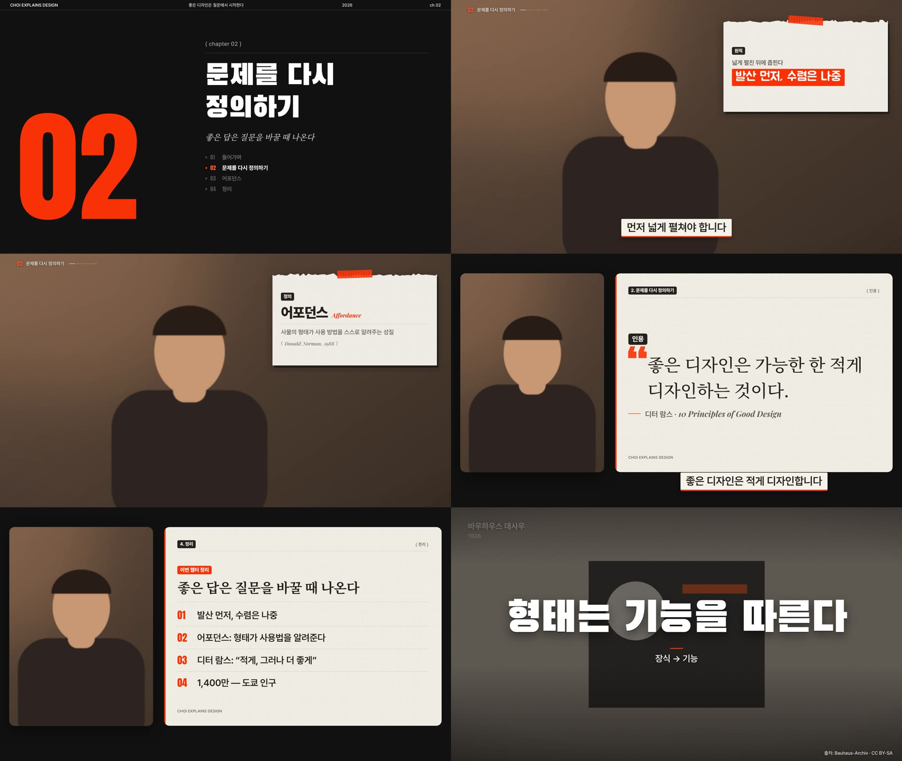

<div align="center">


# Choi Studio

**토킹헤드 원본 + 대본 → 유튜브 롱폼 1편 + 숏폼 1~2편. Windows 데스크톱 오토파일럿.**

[](#빠른-시작)
[](#빠른-시작)
[](https://www.remotion.dev)
[](#ai-연결과-비용)

[무엇을 만드나](#무엇을-만드나) · [화면 디자인](#화면-디자인) · [서체](#서체-역할표) · [작동 방식](#작동-방식) · [편집 원칙](#편집-원칙) · [빠른 시작](#빠른-시작) · [FAQ](#자주-묻는-질문)

</div>

<br>

<p align="center">
  
</p>

## 무엇을 만드나

디자인 이론 채널 *Choi Explains Design* 용으로 만든 개인 편집 도구입니다. **세 가지만 넣습니다.**

| 넣는 것 | 나오는 것 |
|---|---|
| **① 주제 설명** — 무엇을, 누구에게, 왜 | **롱폼 1편** — 16:9 · 1080p · −14 LUFS · 오프닝 하이라이트(≤20초) → 처음부터 |
| **② 원본 영상** — NG·다시 말한 부분이 섞인 그대로. 여러 각도·여러 파일 가능 | **숏폼 1~2편** — 9:16 전용 구성. 제대로 된 한 편이 우선, 둘째는 다른 아이디어로 확실할 때만 |
| **③ 대본** — 붙여넣기 또는 `.txt` `.docx` `.hwpx` | **부가 자료** — 썸네일 3장 · 자막(SRT) · 업로드 정보 · 편집 리포트 · 검토 시트 · Premiere XML |

컷 편집 · 모션그래픽 · 자막 · 색보정 · 효과음과 음악 · 렌더링을 차례로 처리합니다. 설정할 것은 없습니다 — 화면 구성, 강조, 음악, 숏폼 구간, 앵글은 모두 자동으로 정합니다.

<br>

## 화면 디자인

<p align="center">
  
</p>
<p align="center"><sub>롱폼 디자인 스틸(합성 화자). 왼쪽 위부터: 챕터 카드 · 키워드 메모 · 정의 메모 · 인용 보드 · 정리 보드 · 자료 사진 위 키워드 슬램</sub></p>

### 롱폼 무대 — 롱폼만의 로직

숏폼은 세로로 쌓고 카드를 갈아 끼우지만, 롱폼은 **화자 열(36%) + 작업대 열(64%)의 가로 무대**에서 요소가 같은 자리에 머물고 쌓입니다. 10분 넘게 보는 시청자가 "지금 어디쯤, 무슨 주장인지"를 늘 알도록 **오리엔테이션 장치 셋**을 둡니다. 설계 문서: [`docs/롱폼_무대_디자인.md`](docs/롱폼_무대_디자인.md).

| 부품 | 자리 | 하는 일 |
|---|---|---|
| **컨텍스트 스트립** | 좌상단 | `02` + 챕터 제목 + 챕터 진행 눈금. 전체화면·보드 동안은 숨김 |
| **챕터 카드** | 전면 | 거대 번호 + 제목 + **주장 한 문장**(명조 기울임) + **목차**(전체 챕터, 지금 챕터 강조) |
| **종이 메모** | 얼굴 반대편 | 키워드(핵심 줄 **반전 상자**) · 정의(용어 + 영문 + 풀이) · 숫자(카운트업) · 인용(명조) · 사진·스톡(종이 위에 붙인 사진 + 캡션) |
| **오늘의 주제** | 좌하단, 타이틀 뒤 | 칩 + 이 영상이 답할 질문 한 줄(논지), 화자 이름 위 5.6초. 얼굴만 보이는 첫 빈 자리에(그래픽을 밀어내지 않음) |
| **'!' 소제목 바** | 화면 위 | 짧은 키워드(16자 이하). 소단락마다 90~150초에 하나, 4.5초 이상('이유 1 · …'). 머리 위가 비어 있을 때만 |
| **보드 판** | 화자 판 옆 | 도식·목록·비교·인용·스톡·모션 장면. 화자는 둥근 화자 판에 |
| **키워드 슬램** | 전면 자료 위 | 사진 바로 뒤의 키워드는 같은 사진이 어두워지며 큰 키워드 + 'A → B' |
| **정리 보드** | 챕터 끝 7초 | 그 챕터의 키워드·정의·숫자·도식 제목 2~4개를 앱이 모아 정리(강조 순간·펀치 구간은 덮지 않음) |
| **콜아웃** | 얼굴 반대편 | 칩 라벨 + 굵은 2줄, 핵심어 밑줄 스윕. 강조 글라이드와 따로 20초 간격까지(레퍼런스의 얼굴+오버레이 약 21%) |
| **자막** | 하단 | 크림 상자(43px, 바닥 56px) + 시그널 아래 테두리, 한두 마디씩 구(句) 단위, 핵심어 어간 시그널 |

**재질은 종이 메모 룩** — 크림 종이 · 웜 잉크 · 시그널(채널 주황) **세 색뿐**. 위가 찢긴 메모 + 테이프 + 잉크 배지, 하프톤·섬유 질감, 전면 자료는 필름 룩(비네팅 + 입자) + 우하단 "출처". 모션은 하나: **바깥에서 안으로 쓸어 들어오기 + 괘선 그리기 + 줄 마스크 슬라이드**. 형광펜·드롭인·팝은 롱폼에 쓰지 않습니다.

**얼굴을 가리지 않습니다.** 메모·사진·소제목 바·콜아웃은 그 구간의 얼굴 트랙으로 빈 쪽과 크기를 정하고, 자리가 없으면 화자 판 + 보드 판으로 바꿉니다.

### 서체 역할표

Pretendard 굵은 것 하나로 다 쓰지 않습니다. **내용·성격·크기·자리**로 고르고, 한 화면에 세 가족까지만 씁니다. 모두 OFL 서체이며 설치 때 번들됩니다.

| 역할 | 서체 | 어디에 |
|---|---|---|
| 읽는 글 | **Pretendard** 400–700 | 자막 · 본문 · 목록 · 각주 · 배지. **26px 미만은 늘 이것** |
| 정밀한 제목 | **Pretendard** 800–900 | 용어(정의) · 도식 · 목록 · 비교 제목 |
| 한 방 | **Black Han Sans** | 1–4어절, 90px 이상, 화면 중앙·전면: 키워드 슬램 · 훅 타이틀 · 챕터 제목 · 두 층 자막 핵심어 · 썸네일 |
| 말하듯 붙인 메모 | **Jua** | 2–8어절, 40–70px, 얼굴 옆·위: 메모 헤드라인 · 반전 상자 · 소제목 바 · 콜아웃 · 숏폼 종이 카드 |
| 문장 | **Noto Serif KR** | 인용 · 챕터 주장 · 정리 보드 헤드라인 · 엔드카드 "다음 이야기에서" |
| 큰 숫자 | **Anton** | 챕터 번호 · 카운터 · 순번 |
| 작은 숫자·영문 | **Playfair Display** *italic* | 연도 · 영문 원어(*Affordance*) · 단위 — 글 속 숫자·영문만 자동으로 감쌉니다 |
| 손글씨 주석 | **Nanum Pen Script** | 종이 위, 26px 이상만: 메모 각주 "( Donald Norman, 1988 )" · 사진 캡션 설명 |

모션 장면(`font: heavy | round | hand`)과 자유 HTML 카드(`--font-heavy` `--font-round` `--font-hand` `--font-numeral`)도 같은 가족을 씁니다.

### 종이 콜라주와 하이브리드

채널 운영자가 직접 편집한 템플릿(구겨진 짙은 종이 · 찢어진 액자 · 검정 라벨 + 큰 흰 글씨 · 화자 액자 샷)은 **종이 콜라주**로 남아 있습니다. 영상마다 [`studio/edit/style.py`](studio/edit/style.py) 가 대본·전사·기획을 보고 **챕터마다** 고릅니다 — 개념·사례 중심이면 종이, 구조·과정 중심이면 롱폼 무대. 모든 챕터가 한쪽으로 쏠리면 하나를 반대로 둬서 반드시 섞고, 편집 리포트에 이유를 남깁니다.

### 숏폼 — 릴스식

위 큰 카드 · 아래 얼굴 · 이음새에 한두 마디 굵은 자막. 카드는 굵은 고딕 + 형광펜 · 기울인 명조 · 어두운 종이(Jua)를 번갈아 쓰고, 사진이 있으면 첫 2.2초는 부채꼴 카드 + 큰 제목(Black Han Sans). 3–5초마다 화면이 바뀌고 첫 3초는 훅입니다.

<br>

## 작동 방식

<p align="center">
  
</p>

단계마다 결과를 저장하므로 중간에 멈춰도 다시 실행하면 끝난 단계는 건너뜁니다.

| 단계 | 하는 일 |
|---|---|
| **01 분석** | 원본이 여러 개면 소리로 싱크를 맞춰 다시점/나눠 찍기를 가림 · 목소리를 재서 **필요한 만큼만** 보정 · Whisper 단어 단위 인식 + VAD 쉼 · **단어 단위 실수 정리**(다시 말한 앞부분·추임새) · 얼굴 추적 · **대본 정렬**(가장 또렷한 테이크, 대본 문장은 빠지지 않음) · 자동 색보정(교정 → 룩 → 피부 보호) |
| **02 기획** | Claude 제작팀: 총괄 감독이 **논지 한 문장 + 챕터마다 주장 한 문장**을 정하고, 편집·모션·자료·자막·숏폼·카피 전문가가 동시에 일함. 8–15초마다 도식·키워드·자료 사진(위키백과 대표 이미지)·스톡·모션 장면·자유 HTML 카드. 숏폼은 **제대로 된 한 편** 우선. 오프닝 하이라이트 문장 2–4개. 아트 디렉터가 실제 렌더 화면을 검수 |
| **03 편집** | 편집 문법 엔진이 프레이밍(100↔106%) · 소프트 컷 · 글라이드 강조 · 전환(블러·푸시·와이프·빛샘) · 효과음 · 음악을 입힘. 롱폼 무대 배치(얼굴 회피 · 소제목 바 · 키워드 슬램 · 정리 보드), 구 단위 자막, **편집 오류 검사**(완성된 목소리를 다시 받아 적어 남은 실수를 한 번 더 자름) |
| **04 마무리** | Remotion 무음 렌더(30fps) → 목소리 + 덕킹 음악(챕터마다 곡 교체) + 효과음 → −14 LUFS 마스터 → 썸네일 · 자막 · 업로드 정보 · 검토 시트 · XML |

**서로 기다릴 필요가 없는 일은 동시에 합니다.** 한 줄로 차례차례 돌던 16단계를 의존 관계대로 묶었습니다.

```
영상 확인 → [목소리 → 음성 인식 ∥ 얼굴 추적] → 대본 맞추기
          → [AI 기획 ∥ 색보정 → 편집본 인코딩] → 컷
          → [편집 오류 검사 ∥ 자료 사진 → 스톡 ∥ 효과음 · 렌더 준비] → 검수
          → 렌더(그동안 음향 믹스) → 영상과 합치기 → 마무리
```

- AI 기획(네트워크)이 도는 몇 분 동안 GPU·CPU 는 편집본을 인코딩하고, 음성 인식(GPU)이 도는 동안 CPU 는 얼굴을 추적합니다.
- 음성 인식은 배치 추론(GPU 약 3~4배, CPU 약 2배)이고, AI 전문가 여섯이 한 번에 일합니다(예전엔 넷 + 둘).
- 렌더: 화자를 완전히 덮는 전체화면 그래픽 동안은 화자 영상을 그리지 않고(같은 결과), 필름 입자·종이 섬유는 미리 만든 노이즈
  타일로, 분필 질감은 작은 조각만 계산해 깔아서 자료 사진·도식 화면의 렌더가 1.5~2배 빨라졌습니다(모양은 같음).
- 한 단계가 실패하면 같이 돌던 단계를 바로 멈추고 원인 오류를 보여 줍니다. 다시 실행하면 끝난 단계는 건너뜁니다.

<details>
<summary><b>단계별로 자세히</b></summary>

<br>

**01 분석**
- 원본이 여러 개면: 소리 에너지 곡선을 서로 맞춰 보고 같은 순간을 찍은 것(다시점)인지 따로 찍은 것인지 가립니다. 다시점은 시간 차이를 재서 묶고, 따로 찍은 것은 넣은 순서대로 잇습니다. 목소리는 묶음마다 가장 깨끗한 카메라의 소리를 씁니다.
- 목소리: 원본을 먼저 잽니다(잡음 바닥·SNR, 대역별 스펙트럼, 치찰음, 다이내믹). 잡음 제거는 SNR 이 낮을 때만, EQ 는 기준에서 벗어난 만큼의 절반·±2dB 안, 컴프레서는 다이내믹이 넓을 때만. 정상 범위면 손대지 않아 원본보다 먹먹해지지 않습니다. 음량은 선형 게인 + 리미터로 맞춥니다.
- 음성 인식: Whisper large-v3 로 단어 단위 시각을 얻고, 말소리 구간(VAD)으로 실제 쉼을 다시 잽니다.
- 실수 정리: 단어 단위로 다시 말한 앞부분("그것의 평가가 / 그것의 평가가 거의 전부")과 떨어진 추임새를 지웁니다. 끝까지 말한 다른 문장은 지우지 않고, 어간이 다른 낱말(디자인은/디자이너는)이나 담화 표지(그래서·이제)는 되풀이의 증거로 치지 않습니다. 지운 자리는 실제 쉼 안에서 잘라 말 꼬리가 새지 않습니다.
- 얼굴 추적·화면 품질: YuNet 으로 얼굴 위치를 따라가고 초점·밝기·정면을 보는지를 함께 잽니다.
- 대본 정렬: 같은 문장을 여러 번 말했으면 가장 또렷하고 잘 나온 테이크를 남깁니다. A+B 를 말한 뒤 B 만 다시 말했으면 B 는 새 테이크, A 는 앞 테이크에서 살립니다. 빠진 대본 문장은 되살리고, AI 가 대본 문장을 빼자고 해도 거절합니다. 결과는 편집 리포트의 '대본 충실도' 절에 남습니다.
- 자동 색보정: 교정(피부가 피부색 선에 오도록 화이트밸런스, 얼굴 밝기, 명암 범위) → 이 영상에 맞춘 양(룩의 목표까지 대비·채도·온기가 모자란 만큼만) → 피부 점검. 흰 것은 흰색으로, 배경은 장면의 빛을 지킵니다. 3D LUT 로 구워 롱폼·숏폼·썸네일이 같은 색입니다.

**02 기획**
- 그래픽 글자는 말의 요약이 아니라 논지의 한 조각(제목 = 주장, 항목 = 근거)이라, 그래픽만 이어 읽어도 영상의 뼈대가 보입니다.
- 숏폼 PD 는 아이디어 하나를 연속 구간으로, 롱폼을 안 본 사람이 얻는 한 문장까지 씁니다. 앱이 이해 가능성(건너뛴 발화·앞 문맥에 매달린 첫말·안 끝난 끝말·훅과 말의 불일치)을 다시 재고, 둘째 편은 다른 아이디어로 8점 이상일 때만 만듭니다.
- 대본의 인물·작품·사물·브랜드·장소 이름은 스톡 대신 위키백과 문서의 대표 이미지(자유 라이선스만, 크레딧 표기)를 씁니다. 없으면 스톡으로 대체하지 않고 뺍니다.
- 자료 사진 바로 뒤에 개념 이름을 붙이는 키워드가 오면 앱이 사진 위 키워드 슬램으로 합칩니다. 챕터 끝 정리 보드도 앱이 넣습니다.
- 챕터의 핵심 개념 1~2곳은 자유 HTML 카드(HyperFrames 카드 규약 호환)로 직접 디자인하고, 렌더 전에 실제 브라우저에서 글꼴·넘침·글자 크기·대비를 검사합니다.
- 컬러리스트는 룩 비교 시트를 보고 톤을 고르고, 아트 디렉터는 렌더된 화면에서 글자 넘침·가독성 문제를 찾아 수정을 지시합니다.

**03 편집**
- 프레이밍은 실수를 잘라낸 자리·챕터·그래픽에서 돌아올 때만 조금(6%) 바꾸고, 같은 프레이밍으로 이어지는 점프컷은 0.1초 섞습니다. 다시점은 점프컷 자리에서 앵글을 바꿉니다.
- 강조는 0.7초에 걸쳐 천천히 당깁니다. 편집 감독이 고른 펀치 구간(훅·클라이맥스, 전체의 25% 이하)에서만 하드 펀치인·단어 슬램 자막·휩 전환을 허용합니다.
- 자막은 "철수는 오늘 / 비행기를 타고 / 로스앤젤레스로 향하는 / 길이었다"처럼 구 단위로 끊고, 화면 그래픽이 같은 말을 보여 주는 동안 숨깁니다(SRT 에는 남김). 핵심어가 있는 한 마디는 가끔 두 층 강조 자막으로 띄웁니다.
- 편집 오류 검사: 확실한 되풀이만 자릅니다. 차분한 호흡에서는 문장 사이 0.8초·문장 안 1초까지의 쉼을 그대로 둡니다.

**04 마무리**
- 롱폼과 숏폼은 따로 구성합니다 — 숏폼은 롱폼을 잘라 붙인 화면이 아닙니다. 60fps 원본은 30fps 로 내보냅니다.
- 업로드용 제목 후보, 챕터 타임코드가 들어간 설명란, 태그, 썸네일, 검토 시트(2.5초마다 한 장)를 만듭니다.

</details>

<br>

## 편집 원칙

기본값은 레퍼런스 연구(셜록현준 등 롱폼 9편·숏폼 10편 실측, 리텐션 편집 가이드, 교육 영상 연구)와 채널 운영자의 피드백에서 가져왔습니다. 출처는 [`docs/research`](docs/research), 에이전트가 읽는 요약은 [`prompts/playbook`](prompts/playbook), 수치는 [`studio/edit/grammar.py`](studio/edit/grammar.py) 의 `PARAMS` 한 곳에 있습니다.

| 항목 | 기본값 |
|---|---|
| 그래픽 밀도 | 8–15초마다 하나, 얼굴만 보이는 구간 최대 12초 |
| 화면 구성 | 자동 하이브리드: 챕터마다 롱폼 무대 / 종이 콜라주, 타이틀은 늘 종이 |
| 서체 | 역할표대로, 한 화면에 세 가족까지 |
| 프레이밍 | 100% ↔ 106%, 실수를 잘라낸 자리·챕터·그래픽 복귀에서만. 같은 프레이밍 점프컷은 0.1초 소프트 컷 |
| 강조 | 0.7초 글라이드 +4–9%, 영상당 최대 8회. 펀치 구간(≤25%)에서만 하드 펀치인 +6–14% |
| 다시점 앵글 | 점프컷 자리에서 교차, 바꾼 뒤 최소 2.5초, 한 앵글 최대 9초(숏폼 7초) |
| 장면 전환 | 블러·푸시·와이프·빛샘, 컷 지점 중심 오버레이(길이·싱크 불변) |
| 효과음·음악 | 그래픽 성격별 작은 효과음, 음악은 목소리보다 약 20 LU 아래·챕터마다 곡 교체, 최종 −14 LUFS · −1 dBTP |
| 자막 | 한두 마디(13자·2.4초 이하)를 구 단위로, 말소리 시작에 맞춤, 그래픽과 같은 말이면 숨김 |
| 대본 충실 | 대본 문장은 빠지지 않음: 고쳐 말한 문장은 새 테이크, 빠진 문장 복원, AI 의 대본 문장 삭제 거절 |
| 목소리 | 원본 분석 → 편차의 절반만(±2dB), 잡음 제거는 SNR 이 낮을 때만, 선형 라우드니스 |
| 얼굴 회피 | 메모·사진·소제목 바·콜아웃은 얼굴 트랙으로 빈 자리를 정하고, 없으면 화자 판 + 보드 판 |
| 오프닝 하이라이트 | 임팩트 문장 2–4개(각 ≤7초, 합쳐 ≤20초) → 빛샘 전환 → 타이틀 → 처음부터 |
| 정리 보드 | 45초 넘는 챕터 끝 7초, 핵심 개념 2–4개, 강조 순간·펀치 구간은 덮지 않음 |
| 색 | 교정(피부를 피부색 선에 · 얼굴 55–70 IRE) → 룩은 목표, 양은 영상마다 → 피부 보호(색상 32–60°, 채도 ≤30) |
| 숏폼 | 제대로 된 한 편 우선(아이디어 하나 · 연속 구간 · 시청자가 얻는 한 문장), 위 카드 · 아래 얼굴 · 첫 3초 훅 |

<br>

## 빠른 시작

### 요구 사항

| | |
|---|---|
| 운영체제 | Windows 10 / 11 (64비트) |
| 그래픽 | NVIDIA GPU 권장. 없으면 CPU 로 동작하지만 느립니다 |
| 저장 공간 | 설치 약 7GB, 작업까지 20GB 이상 |
| AI | Claude Pro 또는 Max 구독(Claude Code). 없으면 규칙 기반으로 편집합니다 |
| 네트워크 | 설치, 자료 검색, 효과음·음악 내려받기에 필요 |

### 설치

1. 이 페이지의 **Code → Download ZIP** 으로 받아 여유 있는 드라이브에 풉니다(예: `D:\ChoiStudio`).
2. **`setup_windows.bat`** 을 더블클릭합니다. 관리자 권한으로 다시 열리므로 사용자 계정 컨트롤 창에서 **예**를 누릅니다. 처음 한 번 20–40분 걸립니다.
3. 바탕화면의 **Choi Studio** 를 엽니다.

새 버전으로 파일을 덮어쓴 뒤에는 `run_studio.bat` 이 늘어난 파이썬 패키지와 렌더러 패키지(서체 포함)를 자동으로 설치합니다.

<details>
<summary>설치 과정에서 하는 일</summary>

<br>

- Python · Node.js · FFmpeg(NVENC)가 없으면 프로그램 폴더 안에 설치합니다(winget 불필요).
- 파이썬 패키지와 GPU 음성 인식 라이브러리를 설치합니다.
- 렌더러(Remotion)와 렌더링용 Chrome, 번들 서체 7종을 설치합니다.
- Claude Code 를 설치하고 Claude 계정 로그인을 안내합니다.
- 효과음·배경음악·잡음 제거 모델(약 80MB)을 내려받습니다.
- Pixabay API 키를 물어봅니다(선택). 키가 있으면 스톡 영상 B-roll 도 씁니다.
- 바탕화면 바로가기를 만듭니다(항상 관리자 권한으로 실행).
- Whisper 음성 인식 모델(약 3GB)을 미리 받을 수 있습니다.

</details>

### 사용

세 칸을 채우고 **영상 만들기**를 누릅니다.
- 원본 영상은 칸을 눌러 고르거나, 탐색기에서 끌어다 놓거나, 파일을 복사한 뒤 `Ctrl+V` 로 넣습니다.
- 여러 각도로 찍었거나 나눠 찍었으면 영상을 모두 넣습니다(한꺼번에 고르기 · **＋ 다른 각도·추가 영상**). 나눠 찍은 파일은 넣은 순서대로 이어집니다.
- 진행 화면에서 단계, 남은 시간, AI 팀 작업 기록, 실시간 미리보기를 볼 수 있습니다.
- 끝나면 결과 화면에서 바로 재생하거나 폴더를 엽니다.

<table>
  <tr>
    <td width="50%"></td>
    <td width="50%"></td>
  </tr>
  <tr>
    <td align="center"><sub>진행 화면</sub></td>
    <td align="center"><sub>결과 화면</sub></td>
  </tr>
</table>

결과는 `projects/<날짜_제목>/output/` 에 저장됩니다.

```
output/
├── 1_롱폼_<제목>.mp4
├── 2_숏폼1_<제목>.mp4
├── 3_숏폼2_<제목>.mp4
├── 업로드정보.txt
└── 부가자료/
```

- `업로드정보.txt`: 제목 후보, 설명란(챕터 타임코드 포함), 태그, 고정 댓글, 숏폼 캡션
- `부가자료/`: 썸네일 3장, 자막(.srt), 색보정 전후, 편집 리포트, 검토 시트, Premiere Pro XML, 진단 자료

<br>

## AI 연결과 비용

기본으로 이 PC 의 **Claude Code** 를 통해 Claude 를 부릅니다.
- Claude Code 의 `claude -p` 사용량은 Pro/Max **구독 한도에서 차감**되므로 API 를 따로 결제하지 않습니다([Anthropic 안내](https://support.claude.com/en/articles/15036540-use-the-claude-agent-sdk-with-your-claude-plan)).
- 실행할 때 `ANTHROPIC_API_KEY` 환경변수를 빼고 호출하므로 API 요금으로 새지 않습니다.
- 영상 한 편에 에이전트 호출은 12–15회입니다.
- 한도에 걸리면 한도가 풀린 뒤 **최근 작업 → 이어서 만들기**를 누르면 끝난 단계는 건너뜁니다.
- API 키 방식으로도 바꿀 수 있습니다(⚙ 고급 설정, 종량제).

<br>

## 자주 묻는 질문

<details>
<summary><b>설정할 것이 있나요?</b></summary>

<br>

없습니다. 제목, 화면 구성, 얼굴과 그래픽 배분, 강조, 음악, 숏폼 구간, 앵글은 모두 자동으로 정합니다. 오른쪽 위 ⚙(고급 설정)에서 바꿀 수 있는 것은 AI 연결 방식, 스톡 키, 브랜드 색·이름, 저장 경로 정도입니다.

</details>

<details>
<summary><b>카메라 두 대로 찍었어요 / 여러 번에 나눠 찍었어요.</b></summary>

<br>

② 칸에 영상을 모두 넣으면 됩니다.
- **같은 순간을 다른 각도에서 찍은 것**: 소리로 싱크를 맞춥니다(녹화 시작 시각이 달라도 됩니다). 목소리는 가장 깨끗한 카메라의 소리를 쓰고, 화면은 구간마다 얼굴이 잘 보이고 초점·밝기가 맞는 앵글을 골라 점프컷 자리에서 교차합니다. 카메라마다 색을 따로 맞춰 같은 룩으로 모읍니다.
- **나눠 찍은 것**: 넣은 순서대로 잇습니다. 앞 파일에서 한 말을 뒤 파일에서 다시 했으면 더 또렷하고 잘 나온 쪽만 남깁니다.
- 소리가 없는 영상은 싱크를 맞출 수 없어 뺍니다. 어느 구간에 어느 앵글을 썼는지는 `work/angles.json` 과 편집 리포트에 남고, Premiere XML 도 조각마다 해당 카메라 파일을 가리킵니다.

</details>

<details>
<summary><b>왜 관리자 권한으로 실행되나요?</b></summary>

<br>

설치 중 사용자 폴더 쓰기 제한 때문에 생기던 오류(`ENOSPC`, `not enough space`)를 피하기 위해서입니다. 관리자 창에서도 탐색기 끌어다 놓기가 되도록 따로 처리했습니다.

</details>

<details>
<summary><b>내려받은 ZIP 이 왜 작나요?</b></summary>

<br>

저장소에는 소스 코드만 있습니다. 무거운 부품(Whisper 모델 3GB, GPU 라이브러리 1.5GB, 렌더러 0.5GB 등)은 설치할 때 각 배포처에서 받습니다. 설치가 끝나면 폴더는 약 6GB 입니다.

</details>

<details>
<summary><b>남은 시간은 얼마나 정확한가요?</b></summary>

<br>

처음 한 번은 원본 길이·fps·GPU 여부로 넉넉하게 잡아, 시간이 늘어나기보다 줄어드는 쪽으로 보입니다. 단계가 진행되면 실제 속도로 바로잡고, 끝난 작업의 단계별 시간을 기록해 두었다가 다음 작업부터는 이 PC 속도에 맞춰 예측합니다.

</details>

<details>
<summary><b>Pixabay 키를 넣었는데 스톡·효과음이 안 쓰였어요.</b></summary>

<br>

작업이 끝나면(실패해도) `부가자료/진단자료.zip` 과 `work/진단.md` 가 만들어집니다. 키가 인식됐는지(값은 적지 않고 있음/없음만), 제공처별 검색 결과, 접속 방식별 실패 이유(인증서·403 차단 등)가 적혀 있습니다. Pixabay 는 몰아서 받으면 잠시 막는데, 프로그램이 간격을 두고 다른 접속 방식으로 다시 받고, 한 번 막혔다고 그 작업 전체에서 빼지 않습니다.

</details>

<details>
<summary><b>실수한 부분이 남아 있어요.</b></summary>

<br>

`편집리포트.md` 에 지운 구간(다시 말한 앞부분·추임새)과 편집 오류 검사에서 추가로 자른 곳이 시간과 함께 적혀 있습니다. 남은 곳이 있으면 그 시간과 문장을 알려 주세요 — 판단 규칙을 고치는 데 씁니다.

</details>

<details>
<summary><b>GPU 가 없어도 되나요?</b></summary>

<br>

됩니다. 음성 인식과 인코딩이 CPU 로 바뀌어 시간이 몇 배 더 걸립니다. 음성 인식은 CPU 에서도 배치 추론이라 예전보다 약 두 배 빠르고,
편집본 인코딩은 화질 차이가 없는 빠른 프리셋을 씁니다. 메모리가 모자라 음성 인식이 멈추면 설정 파일의 `whisper_batch` 를 4 나 1(순차)로 낮추세요.

</details>

<details>
<summary><b>결과를 직접 손보고 싶어요.</b></summary>

<br>

`부가자료/롱폼_premiere.xml` 을 Premiere Pro 에서 열면 컷이 그대로 들어옵니다. AI 가 정한 구성과 강조는 `부가자료/plan.json` 과 `편집리포트.md` 에 남아 있습니다.

</details>

<br>

## 문제 해결

<details>
<summary><b>증상별 해결 방법 펼치기</b></summary>

<br>

| 증상 | 해결 |
|---|---|
| 설치 창이 바로 닫힘 | 사용자 계정 컨트롤 창에서 **예**를 눌렀는지 확인하세요. 파일을 오른쪽 클릭 → *관리자 권한으로 실행*도 됩니다 |
| `No space left on device` · `ENOSPC` | 설치 첫 화면의 쓰기 테스트 표에서 `WRITE FAILED` 인 위치가 원인입니다. 폴더를 여유 있는 드라이브로 옮겨 다시 실행하세요 |
| `폰트 로드 실패: Jua …` | 새 버전의 서체가 아직 설치되지 않은 것입니다. `run_studio.bat` 을 다시 열면 자동으로 설치되고, 안 되면 `renderer` 폴더에서 `npm install` |
| `HF_TOKEN` 경고 | 정상입니다. 토큰 없이도 모델을 받습니다. 속도 제한(429)으로 멈출 때만 Hugging Face *Read* 토큰을 만들어 `setx HF_TOKEN <토큰>` 후 다시 실행하세요 |
| 헤더에 `○ Claude Code · 로그인 필요` | 그 표시를 누르면 로그인 창이 열립니다 |
| `Claude 구독 사용량 한도에 도달` | 한도가 풀린 뒤 **최근 작업 → 이어서 만들기** |
| `cublas64_12.dll` / `cudnn` 오류 | `setup_windows.bat` 을 다시 실행하거나 ⚙ → 음성 인식 → 장치 `cpu` |
| 효과음·음악이 기본음으로 나옴 | 네트워크 문제로 받지 못한 것입니다. `부가자료/진단자료.zip` 의 실패 이유를 확인하고, 다른 네트워크에서 `setup_windows.bat` 을 다시 실행하세요 |
| 스톡 B-roll 이 하나도 없음 | `진단.md` 의 스톡 항목(요청 수·검색 결과·키 상태)을 확인하세요. 회사·학교망이 인증서를 바꾸는 경우 OS 인증서를 쓰도록 되어 있습니다 |
| 자막 용어가 틀림 | 대본을 넣으면 대본 표기로 교정됩니다. 그 밖에는 ⚙ → 음성 인식 → 용어 사전 |

</details>

<br>

## 현재 한계

- Windows 전용입니다. 리눅스에서는 개발과 테스트만 합니다.
- 결과 품질은 녹화 상태, 대본, AI 판단에 따라 달라집니다. 중요한 영상은 올리기 전에 검토 시트와 함께 한 번 보세요.
- AI 제작팀은 Claude 구독 사용량을 씁니다. 긴 영상을 여러 편 연달아 만들면 한도에 걸릴 수 있습니다.
- 효과음·배경음악은 무료 배포처(Pixabay, Mixkit, Freesound, Incompetech)에서 받습니다. 각 라이선스를 따르고, 곡명은 업로드 정보에 적어 둡니다.
- 업로드는 아직 손으로 합니다(결과 폴더의 영상 + `업로드정보.txt`). 폰에서 넣고 유튜브·인스타그램에 자동으로 올리는 것은 [설계 문서](docs/원격_입력과_자동_업로드_설계.md)에 조사해 두었습니다.
- 렌더는 브라우저가 프레임을 찍는 방식이라 느립니다(GPU 없는 4코어에서 1분 영상에 20분 남짓). 지금까지의 검증은 합성 음성·합성 화자·가짜 AI 로만 했습니다.
- 레퍼런스의 컷아웃 인물 콜라주 타이틀(배경 제거)과 지도 위 측정선 주석은 아직 없습니다.

<br>

<details>
<summary><b>프로젝트 구조</b></summary>

<br>

| 경로 | 내용 |
|---|---|
| `studio/pipeline.py` | 단계 오케스트레이션(분석 → 기획 → 편집 → 검사 → 마무리), 단계별 캐시 |
| `studio/media/sources.py` · `studio/media/voice.py` | 원본 여러 개(소리 싱크·앵글 고르기), 목소리 분석 → 최소 보정 |
| `studio/text/takes.py` · `studio/text/align.py` · `studio/text/captions.py` | 단어 단위 실수 정리, 대본 정렬·테이크 선택, 구 단위 자막 |
| `studio/edit/grammar.py` · `studio/edit/style.py` · `studio/edit/verify.py` | 편집 문법 엔진(`PARAMS`), 하이브리드 화면 구성, 편집 오류 검사 |
| `studio/render/props.py` | 렌더 props: 얼굴 회피 배치 · 소제목 바 · 키워드 슬램 접기 · 정리 보드 · 하이라이트 합치기 |
| `studio/agents/` · `studio/director/` | AI 제작팀, Claude 연결(Claude Code / API), 규칙 기반 대체 |
| `studio/motion/` · `renderer/vendor/hyperframes/` | 모션 DSL, 자유 HTML 카드(정리 · 렌더 전 검사), HyperFrames 카드 규약 컴파일러 |
| `studio/grade/` · `studio/sound/` · `studio/media/mix.py` | 자동 색보정, 효과음·음악 라이브러리, 믹스와 마스터링 |
| `studio/broll/` · `studio/stock/` · `studio/net.py` | 위키백과 대표 이미지, 스톡 검색(Pixabay · Unsplash · Coverr · Pexels · Openverse), 막힘에 강한 통신 |
| `studio/gui/` · `studio/review.py` · `studio/diag.py` · `studio/eta.py` | 데스크톱 창, 검토 시트, 진단 자료, 남은 시간 예측 |
| `renderer/src/components/longform/` | 롱폼 무대: `Stage`(그리드·스트립) · `Plates`(종이 메모) · `Board`(보드 판·정리 보드) · `Note`(메모 재질·소제목 바·키워드 슬램·필름 룩) |
| `renderer/src/components/paper/` · `renderer/src/components/shorts/` | 종이 콜라주(운영자 템플릿), 릴스식 숏폼 |
| `renderer/src/design/` | 토큰(색·서체 역할표 `FONT`·메모 색 `NOTE`), 모션 토큰, 폰트 가드 |
| `prompts/` · `docs/` | 팀 헌장과 에이전트 지시문, 편집 플레이북, 디자인 문서([`롱폼_무대_디자인.md`](docs/롱폼_무대_디자인.md) · [`디자인_시스템.md`](docs/디자인_시스템.md)), 레퍼런스 연구 |

</details>

<details>
<summary><b>개발</b></summary>

<br>

```bash
# 단위 테스트, 렌더러 타입 검사
python -m pytest tests -q
cd renderer && npx tsc --noEmit

# AI 없이 전체 파이프라인(--multi multicam|split: 원본 2개 — 다시점 · 나눠 찍기)
python tests/e2e_synthetic.py --browser <chrome> --face 얼굴.mp4 [--multi multicam]

# 가짜 Claude Code·스톡 서버로 AI 제작팀까지 전체
python tests/e2e_studio.py --browser <chrome>

# 디자인 스틸(템플릿 시각 확인)
cd renderer && npx remotion render src/index.ts LongForm out/f --sequence --frames=160,330 --image-format=jpeg

# 창 없이 실행
python -m studio run --video 원본.mp4 [다른각도.mp4 …] --topic "주제" --script 대본.txt
```

개발 규칙은 [`CLAUDE.md`](CLAUDE.md) 에 있습니다.

</details>

<br>

## 크레딧

- 렌더링: [Remotion](https://www.remotion.dev)(개인·3인 이하 회사 무료, 그 이상은 회사 라이선스)
- 음성 인식: [faster-whisper](https://github.com/SYSTRAN/faster-whisper)
- 얼굴 검출: [YuNet](https://github.com/opencv/opencv_zoo)(MIT)
- 잡음 제거: [RNNoise](https://github.com/xiph/rnnoise) 모델(BSD)
- 서체(모두 SIL OFL): Pretendard · Anton · Noto Serif KR · Black Han Sans · Jua · Playfair Display · Nanum Pen Script
- 종이 텍스처: 프로그램이 절차적으로 생성(외부 이미지 없음)
- 효과음·음악: Pixabay · Mixkit · Freesound · Incompetech(처음 실행할 때 원 배포처에서 받으며 저장소에는 포함하지 않음)
- 스톡·자료 사진·그래픽 이미지: 각 제공처 라이선스를 따르고, 출처를 화면과 설명란에 자동으로 적습니다
