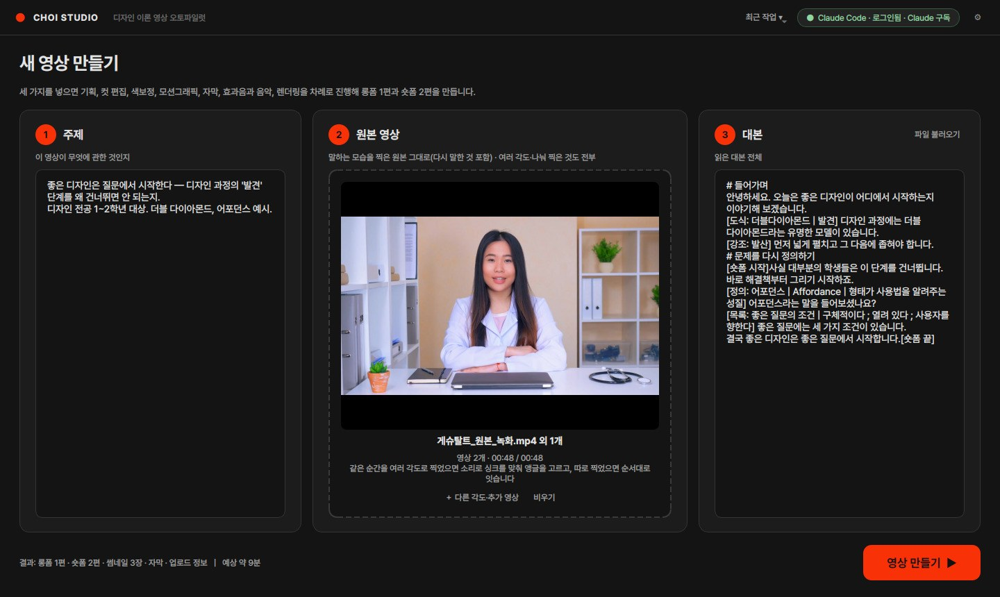
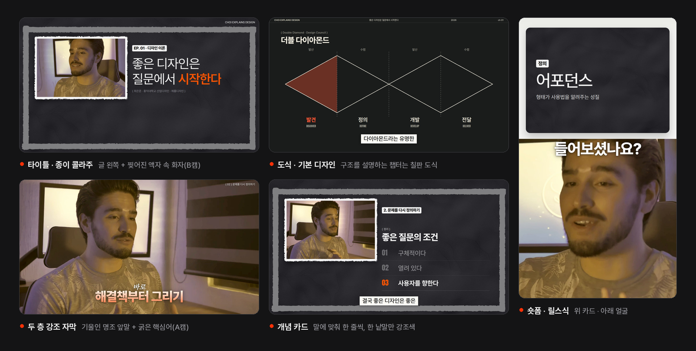
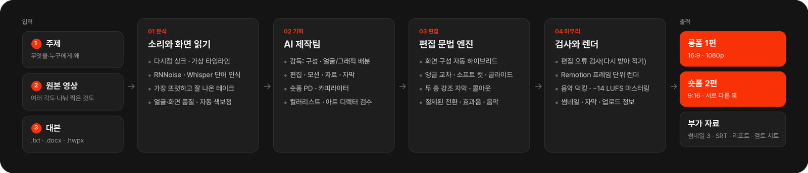
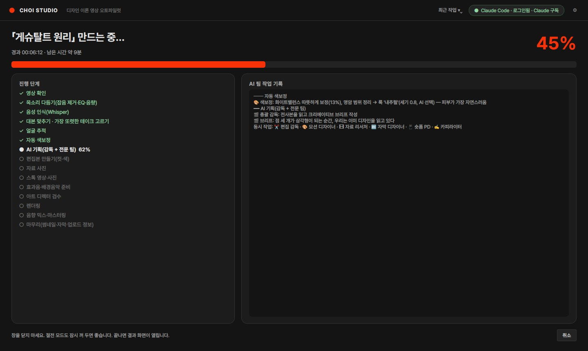
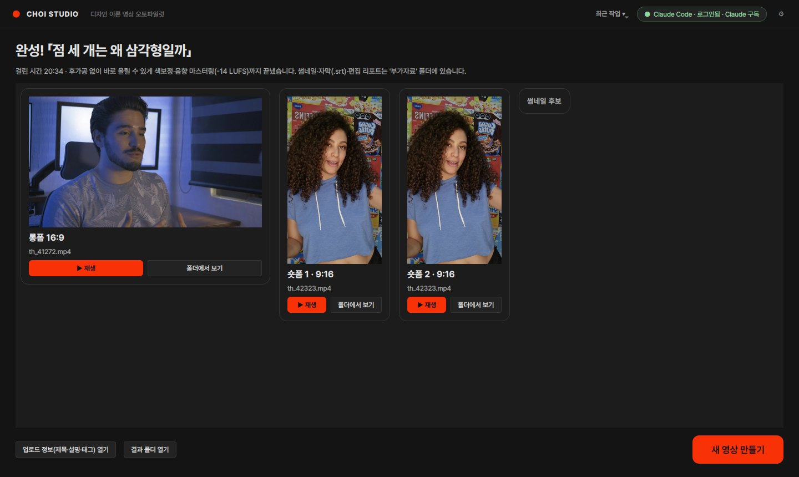

<div align="center">


# Choi Studio

**토킹헤드 원본을 유튜브 롱폼과 숏폼으로 자동 편집하는 Windows 데스크톱 앱**

[](#요구-사항)
[](#요구-사항)
[](https://www.remotion.dev)
[](#ai-연결과-비용)

[빠른 시작](#빠른-시작) · [결과물](#결과물) · [작동 방식](#작동-방식) · [편집 원칙](#편집-원칙) · [자주 묻는 질문](#자주-묻는-질문)

</div>

<br>

<p align="center">
  
</p>

## 소개

Choi Studio 는 디자인 이론 채널 *Choi Explains Design* 을 만들면서 쓰려고 개발한 개인용 편집 도구입니다. 입력은 세 가지입니다.
- 대본을 읽으며 찍은 원본 영상 — 여러 각도로 찍었거나 나눠 찍었으면 여러 개
- 그 대본
- 짧은 주제 설명

이 세 가지로 컷 편집, 모션그래픽, 자막, 색보정, 효과음과 음악, 렌더링을 차례로 처리합니다.

| 입력 | 결과 |
|---|---|
| **주제 설명**: 무엇을, 누구에게, 왜 | **롱폼 1편**: 16:9 · 1080p · −14 LUFS |
| **원본 영상**: 다시 말한 부분과 NG 가 섞인 그대로(여러 각도·여러 파일 가능) | **숏폼 2편**: 9:16 세로 전용 구성 · 서로 다른 훅 |
| **대본**: 붙여넣기 또는 `.txt` `.docx` `.hwpx` | **부가 자료**: 썸네일 3장 · 자막(SRT) · 업로드 정보 · 편집 리포트 · 검토 시트 |

편집 판단은 세 단계로 나눕니다.
1. **Claude 로 구성한 AI 제작팀**이 무엇을 강조하고 어디에 그래픽·자료 사진·스톡을 넣을지 정합니다.
2. **편집 문법 엔진**이 정해 둔 수치대로 프레이밍·전환·효과음·음악을 입힙니다. 교육 영상이라 튀지 않고 부드럽게 움직입니다.
   - 화면 구성은 고르지 않습니다. 대본과 기획을 보고 챕터·그래픽마다 **기본 디자인과 종이 콜라주를 섞습니다**(하이브리드).
   - 원본을 여러 각도로 찍었으면 소리로 싱크를 맞춰, 구간마다 **가장 잘 나온 앵글**을 골라 교차 편집합니다.
3. **편집 오류 검사**가 완성된 목소리를 한 번 더 받아 적어, 남은 되풀이·추임새·긴 무음을 찾아 다시 자릅니다.

<br>

## 결과물

<p align="center">
  
</p>

<sub>스톡 인물 클립을 두 각도(A캠 · 좌우 반전해 당긴 B캠)로 넣고 합성 음성으로 돌린 테스트 렌더입니다. 한 영상 안에서 챕터마다 종이 콜라주와 기본 디자인이 섞이고, 앵글은 점프컷 자리에서 바뀝니다. 실제 녹화와 대본을 넣으면 AI 제작팀이 구성·그래픽·강조 문구를 정합니다. 작업마다 `부가자료/검토시트_*.jpg`(2.5초마다 한 장, 시간·자막 포함)가 함께 나오므로 영상을 끝까지 돌려 보지 않아도 결과를 훑어볼 수 있습니다.</sub>

<br>

## 작동 방식

네 단계로 처리합니다. 단계마다 결과를 저장해 두기 때문에, 중간에 멈춰도 다시 실행하면 끝난 단계는 건너뜁니다.

<p align="center">
  
</p>

<details>
<summary><b>단계별로 자세히</b></summary>

<br>

**01 분석**
- 원본이 여러 개면: 소리 에너지 곡선을 서로 맞춰 보고 같은 순간을 찍은 것(다시점)인지 따로 찍은 것인지 가립니다. 다시점은 시간 차이를 재서 묶고, 따로 찍은 것은 넣은 순서대로 잇습니다. 목소리는 묶음마다 가장 깨끗한 카메라의 소리를 씁니다.
- 목소리: 신경망 잡음 제거(RNNoise)와 방송용 EQ·컴프레서로 다듬습니다. 영상과 소리의 시작 시각이 어긋난 파일은 그 차이만큼 맞춥니다.
- 음성 인식: Whisper large-v3 로 단어 단위 시각을 얻고, 말소리 구간(VAD)으로 실제 쉼을 다시 잽니다.
- 실수 정리: **단어 단위**로 다시 말한 앞부분(“그것의 평가가 / 그것의 평가가 거의 전부”)과 떨어진 추임새(어·음)를 지웁니다. 끝까지 말한 다른 문장은 비슷하게 시작해도 지우지 않습니다.
- 얼굴 추적·화면 품질: YuNet 으로 얼굴 위치를 따라가고(콜아웃·사진이 얼굴을 가리지 않게), 초점·밝기·정면을 보는지를 함께 잽니다.
- 대본 정렬: 같은 문장을 여러 번 말했으면(다른 파일에서 다시 말했어도) **가장 또렷하고 잘 나온 테이크**를 남깁니다. 비교 기준은 대본 일치도, 끝까지 말했는지, 발음 확신도, 추임새·말더듬, 음량, 화면(얼굴·초점)입니다.
- 자동 색보정: 화이트밸런스·노출·명암·채도를 교정한 뒤, 채널 레퍼런스 장면의 따뜻하고 진한 색(CIELAB 기준)에 맞추는 **웜 리치** 룩을 3D LUT 로 굽습니다.

**02 기획**
- 총괄 감독이 브리프를 쓰면 전문가 여섯 명(편집, 모션, 자료, 자막, 숏폼, 카피)이 동시에 일합니다.
- 말하는 내용이 화면에 보이도록 8–15초마다 도식·키워드·자료 사진·스톡·모션 장면을 둡니다. 모션 장면에는 Pixabay 그래픽 이미지(투명 오브젝트·일러스트·사진)를 직접 넣습니다.
- 컬러리스트는 룩 비교 시트를 보고 톤을 고릅니다.
- 아트 디렉터는 실제 렌더된 화면을 보고 글자 넘침이나 가독성 문제를 찾아 수정을 지시합니다.

**03 편집**
- 화면 구성(자동 하이브리드): 개념·사례가 중심인 챕터는 종이 콜라주(구겨진 종이·찢어진 액자·개념 카드), 구조·과정이 중심인 챕터는 기본 디자인(칠판 패널·분필 도식)으로 두고, 한쪽으로만 쏠리면 섞습니다.
- 프레이밍은 실수를 잘라낸 자리·챕터·그래픽에서 돌아올 때만 조금(6%) 바꾸고, 같은 프레이밍으로 이어지는 점프컷은 0.1초 섞어 튀지 않게 합니다.
- 다시점: 점프컷 자리에서 앵글을 바꿔 컷을 가리고, 초점이 나갔거나 얼굴이 빠진 앵글은 피합니다. 한 앵글이 너무 오래 이어지면 비슷하게 좋은 다른 앵글로 교차합니다.
- 강조는 한 번에 확 당기지 않고 0.7초에 걸쳐 천천히 당깁니다. 화자 반대편 빈 공간에 키워드 콜아웃을 띄웁니다.
- 장면 전환은 블러·푸시·와이프·빛샘만 씁니다. 전환은 컷 지점을 중심으로 한 오버레이라 영상 길이와 음성 싱크가 바뀌지 않습니다.
- 자막은 한두 마디씩 말소리에 맞춰 나오고, 화면 그래픽이 같은 말을 이미 보여 주는 동안에는 숨깁니다(SRT 에는 남김). 핵심어가 있는 한 마디는 가끔 **두 층 강조 자막**(기울인 명조 앞말 + 아주 굵은 핵심어)으로 띄웁니다.
- 편집 오류 검사: 잘라 붙인 목소리를 다시 인식해 남은 되풀이·추임새·긴 무음을 찾아 한 번 더 자릅니다.

**04 마무리**
- Remotion 으로 프레임 단위 렌더를 합니다(무음, 30fps — 60fps 원본은 30fps 로). 롱폼과 숏폼은 따로 구성합니다 — 숏폼은 롱폼을 잘라 붙인 화면이 아닙니다.
- 목소리, 덕킹한 배경음악(챕터마다 곡 교체), 효과음을 섞어 −14 LUFS · −1 dBTP 로 마스터링합니다.
- 업로드용 제목 후보, 챕터 타임코드가 들어간 설명란, 태그, 썸네일, 검토 시트를 만듭니다.

</details>

<br>

## 편집 원칙

기본값은 레퍼런스 연구와 채널 운영자의 피드백에서 가져왔습니다. 연구에는 셜록현준 등 롱폼 9편과 숏폼 10편 실측, 리텐션 편집 가이드, 교육 영상 연구가 들어가고, 채널 운영자가 직접 편집한 장면·참고 릴스·Nick Saraev 채널(자막·전환·효과음·음악)로 스타일을 맞췄습니다. 수치와 출처는 [`docs/research`](docs/research) 에, 에이전트가 읽는 요약본은 [`prompts/playbook`](prompts/playbook) 에, 편집 수치는 [`studio/edit/grammar.py`](studio/edit/grammar.py) 의 `PARAMS` 한 곳에 있습니다.

| 항목 | 기본값 | 근거 |
|---|---|---|
| 그래픽 밀도 | 8–15초마다 하나, 얼굴만 보이는 구간 최대 12초 | 셜록현준 실측(5–6초마다 화면 변화) · “그래픽이 너무 적다” 피드백 |
| 화면 구성 | 자동 하이브리드: 챕터마다 기본 디자인 / 종이 콜라주, 개념 카드·타이틀은 늘 종이 | “고르지 말고 알아서 섞어 달라” 피드백 · 운영자 템플릿 |
| 프레이밍 | 100% ↔ 106%, 실수를 잘라낸 자리·챕터·그래픽 복귀에서만 | “훅훅 튀지 않게” 피드백(교육 영상) |
| 다시점 앵글 | 점프컷 자리에서 교차, 바꾼 뒤 최소 2.5초, 한 앵글 최대 9초(숏폼 7초·가까운 앵글 선호) | 멀티캠 토크 편집 관례 |
| 점프컷 | 같은 프레이밍은 0.1초 소프트 컷(앞 장면 마지막 프레임을 섞음) | 같은 피드백 |
| 강조 | 0.7초 글라이드 +4–9%, 영상당 최대 8회 | 같은 피드백 |
| 장면 전환 | 블러·푸시·와이프·빛샘, 컷 지점 중심 오버레이 | 리텐션 편집 가이드 |
| 효과음 | 그래픽 성격별(종이·팝·타자·셔터·스와이프·작은 종), 목소리보다 한참 작게 | 사운드 디자인 가이드 · 피드백 |
| 자막 | 한두 마디(13자·2.4초 이하), 말소리 시작에 맞춤, 그래픽과 같은 말이면 숨김 | 최근 채널 자막 호흡 · 피드백 |
| 강조 자막 | 두 층(기울인 명조 + 굵은 핵심어 그라데이션), 롱폼 18초 · 숏폼 3.5초에 한 번 이하 | Nick Saraev 숏폼 실측 |
| 프레임레이트 | 24/25/30fps(50·60fps 원본은 절반) | 모든 움직임이 30fps 기준 — 60fps 에서 두 배 빨라지던 문제 |
| 색 | 웜 리치(레퍼런스 장면: 따뜻함 b\* ≈ 14.5, 채도 C\* ≈ 17) | 채널 운영자가 편집한 장면 실측 |
| 배경음악 | 목소리보다 약 20 LU 아래, 챕터마다 곡 교체 | 믹싱 가이드 |
| 최종 음량 | −14 LUFS, −1 dBTP | YouTube 재생 기준 |
| 숏폼 | 위 큰 카드 · 아래 얼굴 · 한두 마디 굵은 자막, 3–5초마다 화면 변화, 첫 3초 훅 | 참고 릴스 · Shorts 5,400편 분석 |

### 화면 구성(자동 · 하이브리드)

고르는 설정이 없습니다. 영상마다 대본·전사·기획을 보고 [`studio/edit/style.py`](studio/edit/style.py) 가 정합니다.
- **기본 디자인**: 에디토리얼(칠판 패널·잉크·시그널 표면) 위에 채널 운영자 템플릿의 요소를 얹습니다 — 얼굴 옆 찢어진 액자 사진과 개념 텍스트, 개념 카드의 글 위계(라벨 → 한 낱말만 강조색인 헤드라인 → 본문 → 회색 주석), 우상단 출처, 흰 종이 상자 자막.
- **종이 콜라주**: 템플릿 전체 — 구겨진 짙은 종이, 회색 거친 테두리, 개념 카드 + 화자 액자, 화자를 액자에 담은 세 번째 앵글.
- **섞는 방식**: 개념·사례 중심 챕터는 종이, 구조·과정 중심 챕터는 기본. 개념 카드(키워드·정의·인용·숫자)와 타이틀은 어느 챕터에서든 종이입니다. 모든 챕터가 한쪽으로 쏠리면 하나를 반대로 둬서 반드시 섞습니다. 편집 리포트에 챕터별 구성과 이유가 남습니다.
- **숏폼**: 위 큰 카드 · 아래 얼굴 · 이음새 굵은 자막(참고 릴스). 개념 카드는 굵은 고딕 + 형광펜 · 기울인 명조 · 어두운 종이 카드를 번갈아 씁니다.

<br>

## 빠른 시작

### 요구 사항

| | |
|---|---|
| 운영체제 | Windows 10 / 11 (64비트) |
| 그래픽 | NVIDIA GPU 권장. 없으면 CPU 로 동작하지만 느립니다 |
| 저장 공간 | 설치 약 7GB, 작업까지 20GB 이상 |
| AI | Claude Pro 또는 Max 구독(Claude Code). 없으면 규칙 기반으로 편집합니다 |
| 네트워크 | 설치, 자료 검색, 효과음·음악 내려받기에 필요 |

### 설치

1. 이 페이지의 **Code → Download ZIP** 으로 받아 여유 있는 드라이브에 풉니다(예: `D:\ChoiStudio`).
2. **`setup_windows.bat`** 을 더블클릭합니다.
   - 관리자 권한으로 다시 열리므로 사용자 계정 컨트롤 창에서 **예**를 누릅니다.
   - 처음 한 번 20–40분 걸립니다.
3. 바탕화면의 **Choi Studio** 를 엽니다.

<details>
<summary>설치 과정에서 하는 일</summary>

<br>

- Python · Node.js · FFmpeg(NVENC)가 없으면 프로그램 폴더 안에 설치합니다(winget 불필요).
- 파이썬 패키지와 GPU 음성 인식 라이브러리를 설치합니다.
- 렌더러(Remotion)와 렌더링용 Chrome 을 설치합니다.
- Claude Code 를 설치하고 Claude 계정 로그인을 안내합니다.
- 효과음·배경음악·잡음 제거 모델(약 80MB)을 내려받습니다.
- Pixabay API 키를 물어봅니다(선택). 키가 있으면 스톡 영상 B-roll 도 씁니다.
- 바탕화면 바로가기를 만듭니다(항상 관리자 권한으로 실행).
- Whisper 음성 인식 모델(약 3GB)을 미리 받을 수 있습니다.

</details>

### 사용

세 칸을 채우고 **영상 만들기**를 누릅니다.
- 원본 영상은 칸을 눌러 고르거나, 탐색기에서 끌어다 놓거나, 파일을 복사한 뒤 `Ctrl+V` 로 넣습니다.
- 여러 각도로 찍었거나 나눠 찍었으면 영상을 모두 넣습니다(한꺼번에 고르기 · **＋ 다른 각도·추가 영상**). 나눠 찍은 파일은 넣은 순서대로 이어집니다.
- 진행 화면에서 단계, 남은 시간, AI 팀 작업 기록, 실시간 미리보기(색보정 → 검수 장면 → 렌더링 중인 화면)를 볼 수 있습니다.
- 끝나면 결과 화면에서 바로 재생하거나 폴더를 엽니다.

<table>
  <tr>
    <td width="50%"></td>
    <td width="50%"></td>
  </tr>
  <tr>
    <td align="center"><sub>진행 화면</sub></td>
    <td align="center"><sub>결과 화면</sub></td>
  </tr>
</table>

결과는 `projects/<날짜_제목>/output/` 에 저장됩니다.

```
output/
├── 1_롱폼_<제목>.mp4
├── 2_숏폼1_<제목>.mp4
├── 3_숏폼2_<제목>.mp4
├── 업로드정보.txt
└── 부가자료/
```

- `업로드정보.txt`: 제목 후보, 설명란(챕터 타임코드 포함), 태그, 고정 댓글, 숏폼 캡션
- `부가자료/`: 썸네일 3장, 자막(.srt), 색보정 전후, 편집 리포트, Premiere Pro XML

<br>

## AI 연결과 비용

기본으로 이 PC 의 **Claude Code** 를 통해 Claude 를 부릅니다.
- Claude Code 의 `claude -p` 사용량은 Pro/Max **구독 한도에서 차감**되므로 API 를 따로 결제하지 않습니다([Anthropic 안내](https://support.claude.com/en/articles/15036540-use-the-claude-agent-sdk-with-your-claude-plan)).
- 실행할 때 `ANTHROPIC_API_KEY` 환경변수를 빼고 호출하므로 API 요금으로 새지 않습니다.
- 영상 한 편에 에이전트 호출은 12–15회입니다.
- 한도에 걸리면 한도가 풀린 뒤 **최근 작업 → 이어서 만들기**를 누르면 끝난 단계는 건너뜁니다.
- API 키 방식으로도 바꿀 수 있습니다(⚙ 고급 설정, 종량제).

<br>

## 자주 묻는 질문

<details>
<summary><b>설정할 것이 있나요?</b></summary>

<br>

없습니다. 제목, 화면 구성, 얼굴과 그래픽 배분, 강조, 음악, 숏폼 구간, 앵글은 모두 자동으로 정합니다. 오른쪽 위 ⚙(고급 설정)에서 바꿀 수 있는 것은 AI 연결 방식, 스톡 키, 브랜드 색·이름, 저장 경로 정도입니다.

</details>

<details>
<summary><b>카메라 두 대로 찍었어요 / 여러 번에 나눠 찍었어요.</b></summary>

<br>

② 칸에 영상을 모두 넣으면 됩니다.
- **같은 순간을 다른 각도에서 찍은 것**: 소리로 싱크를 맞춥니다(녹화 시작 시각이 달라도 됩니다). 15초 창마다 같은 시간 차이인지 확인하므로, 같은 대본을 따로 두 번 찍은 영상과 헷갈리지 않습니다. 목소리는 가장 깨끗한 카메라의 소리를 쓰고, 화면은 구간마다 얼굴이 잘 보이고 초점·밝기가 맞는 앵글을 골라 점프컷 자리에서 교차합니다. 카메라마다 색을 따로 맞춰 같은 룩으로 모읍니다.
- **나눠 찍은 것**: 넣은 순서대로 잇습니다. 앞 파일에서 한 말을 뒤 파일에서 다시 했으면 더 또렷하고 잘 나온 쪽만 남깁니다.
- 소리가 없는 영상은 싱크를 맞출 수 없어 뺍니다. 어느 구간에 어느 앵글을 썼는지는 `work/angles.json` 과 편집 리포트에 남고, Premiere XML 도 조각마다 해당 카메라 파일을 가리킵니다.

</details>

<details>
<summary><b>왜 관리자 권한으로 실행되나요?</b></summary>

<br>

설치 중 사용자 폴더 쓰기 제한 때문에 생기던 오류(`ENOSPC`, `not enough space`)를 피하기 위해서입니다. 관리자 창에서도 탐색기 끌어다 놓기가 되도록 따로 처리했습니다.

</details>

<details>
<summary><b>내려받은 ZIP 이 왜 작나요?</b></summary>

<br>

저장소에는 소스 코드만 있습니다. 무거운 부품(Whisper 모델 3GB, GPU 라이브러리 1.5GB, 렌더러 0.5GB 등)은 설치할 때 각 배포처에서 받습니다. 설치가 끝나면 폴더는 약 6GB 입니다.

</details>

<details>
<summary><b>남은 시간은 얼마나 정확한가요?</b></summary>

<br>

처음 한 번은 원본 길이·fps·GPU 여부로 넉넉하게 잡아, 시간이 늘어나기보다 줄어드는 쪽으로 보입니다. 단계가 진행되면 실제 속도로 바로잡고, 끝난 작업의 단계별 시간을 기록해 두었다가 다음 작업부터는 이 PC 속도에 맞춰 예측합니다.

</details>

<details>
<summary><b>Pixabay 키를 넣었는데 스톡·효과음이 안 쓰였어요.</b></summary>

<br>

작업이 끝나면(실패해도) `부가자료/진단자료.zip` 과 `work/진단.md` 가 만들어집니다. 키가 인식됐는지(값은 적지 않고 있음/없음만), 제공처별 검색 결과, 접속 방식별 실패 이유(인증서·403 차단 등)가 적혀 있습니다. Pixabay 는 몰아서 받으면 잠시 막는데, 프로그램이 간격을 두고 다른 접속 방식으로 다시 받고, 한 번 막혔다고 그 작업 전체에서 빼지 않습니다.

</details>

<details>
<summary><b>실수한 부분이 남아 있어요.</b></summary>

<br>

`편집리포트.md` 에 지운 구간(다시 말한 앞부분·추임새)과 편집 오류 검사에서 추가로 자른 곳이 시간과 함께 적혀 있습니다. 남은 곳이 있으면 그 시간과 문장을 알려 주세요 — 판단 규칙을 고치는 데 씁니다.

</details>

<details>
<summary><b>GPU 가 없어도 되나요?</b></summary>

<br>

됩니다. 음성 인식과 인코딩이 CPU 로 바뀌어 시간이 몇 배 더 걸립니다.

</details>

<details>
<summary><b>결과를 직접 손보고 싶어요.</b></summary>

<br>

`부가자료/롱폼_premiere.xml` 을 Premiere Pro 에서 열면 컷이 그대로 들어옵니다. AI 가 정한 구성과 강조는 `부가자료/plan.json` 과 `편집리포트.md` 에 남아 있습니다.

</details>

<br>

## 문제 해결

<details>
<summary><b>증상별 해결 방법 펼치기</b></summary>

<br>

| 증상 | 해결 |
|---|---|
| 설치 창이 바로 닫힘 | 사용자 계정 컨트롤 창에서 **예**를 눌렀는지 확인하세요. 파일을 오른쪽 클릭 → *관리자 권한으로 실행*도 됩니다 |
| `No space left on device` · `ENOSPC` | 설치 첫 화면의 쓰기 테스트 표에서 `WRITE FAILED` 인 위치가 원인입니다. 폴더를 여유 있는 드라이브로 옮겨 다시 실행하세요 |
| `HF_TOKEN` 경고 | 정상입니다. 토큰 없이도 모델을 받습니다. 속도 제한(429)으로 멈출 때만 Hugging Face *Read* 토큰을 만들어 `setx HF_TOKEN <토큰>` 후 다시 실행하세요 |
| 헤더에 `○ Claude Code · 로그인 필요` | 그 표시를 누르면 로그인 창이 열립니다 |
| `Claude 구독 사용량 한도에 도달` | 한도가 풀린 뒤 **최근 작업 → 이어서 만들기** |
| `cublas64_12.dll` / `cudnn` 오류 | `setup_windows.bat` 을 다시 실행하거나 ⚙ → 음성 인식 → 장치 `cpu` |
| 효과음·음악이 기본음으로 나옴 | 네트워크 문제로 받지 못한 것입니다. `부가자료/진단자료.zip` 의 실패 이유를 확인하고, 다른 네트워크에서 `setup_windows.bat` 을 다시 실행하세요 |
| 스톡 B-roll 이 하나도 없음 | `진단.md` 의 스톡 항목(요청 수·검색 결과·키 상태)을 확인하세요. 회사·학교망이 인증서를 바꾸는 경우 OS 인증서를 쓰도록 되어 있습니다 |
| 자막 용어가 틀림 | 대본을 넣으면 대본 표기로 교정됩니다. 그 밖에는 ⚙ → 음성 인식 → 용어 사전 |

</details>

<br>

## 현재 한계

- Windows 전용입니다. 리눅스에서는 개발과 테스트만 합니다.
- 결과 품질은 녹화 상태, 대본, AI 판단에 따라 달라집니다. 중요한 영상은 올리기 전에 한 번 보세요.
- AI 제작팀은 Claude 구독 사용량을 씁니다. 긴 영상을 여러 편 연달아 만들면 한도에 걸릴 수 있습니다.
- 효과음·배경음악은 무료 배포처(Pixabay, Mixkit, Freesound, Incompetech)에서 받습니다. 각 라이선스를 따르고, 곡명은 업로드 정보에 적어 둡니다.

<br>

<details>
<summary><b>프로젝트 구조</b></summary>

<br>

| 경로 | 내용 |
|---|---|
| `studio/pipeline.py` | 단계 오케스트레이션(분석 → 기획 → 편집 → 검사 → 마무리), 단계별 캐시 |
| `studio/media/sources.py` | 원본 여러 개: 소리 싱크·묶음, 가상 타임라인, 앵글 고르기 |
| `studio/edit/style.py` | 화면 구성 자동 선택(하이브리드) |
| `studio/gui/` | 데스크톱 창(입력 · 진행 · 결과), 관리자 창 끌어다 놓기 |
| `studio/agents/` · `studio/director/` | AI 제작팀, Claude 연결(Claude Code / API), 규칙 기반 대체 |
| `studio/text/takes.py` · `studio/text/align.py` | 단어 단위 실수 정리, 대본 정렬·테이크 선택 |
| `studio/edit/grammar.py` · `studio/edit/verify.py` | 편집 문법 엔진(수치는 `PARAMS` 한 곳), 편집 오류 검사 |
| `studio/grade/` | 자동 색보정(레퍼런스 색 맞춤) |
| `studio/sound/` · `studio/media/mix.py` | 효과음·음악 라이브러리, 믹스와 마스터링 |
| `studio/stock/` · `studio/net.py` | 스톡·그래픽 이미지 검색(Pixabay · Unsplash · Coverr · Pexels · Openverse), 막힘에 강한 통신 |
| `studio/review.py` · `studio/diag.py` · `studio/eta.py` | 검토 시트, 진단 자료, 남은 시간 예측 |
| `renderer/` | Remotion 프로젝트(템플릿, 자막, 콜아웃, 전환, 종이 콜라주 `components/paper`, 릴스식 숏폼 `components/shorts`) |
| `prompts/` | 팀 헌장, 에이전트 지시문, 편집 플레이북 |
| `docs/research/` | 레퍼런스 연구 원문 |

</details>

<details>
<summary><b>개발</b></summary>

<br>

```bash
# 단위 테스트, 렌더러 타입 검사
python -m pytest tests -q
cd renderer && npx tsc --noEmit

# AI 없이 전체 파이프라인(--multi multicam|split: 원본 2개 — 다시점 · 나눠 찍기)
python tests/e2e_synthetic.py --browser <chrome> --face 얼굴.mp4 [--multi multicam]

# 가짜 Claude Code·스톡 서버로 AI 제작팀까지 전체
python tests/e2e_studio.py --browser <chrome>

# 창 없이 실행
python -m studio run --video 원본.mp4 [다른각도.mp4 …] --topic "주제" --script 대본.txt
```

개발 규칙은 [`CLAUDE.md`](CLAUDE.md) 에 있습니다.

</details>

<br>

## 크레딧

- 렌더링: [Remotion](https://www.remotion.dev)(개인·3인 이하 회사 무료, 그 이상은 회사 라이선스)
- 음성 인식: [faster-whisper](https://github.com/SYSTRAN/faster-whisper)
- 얼굴 검출: [YuNet](https://github.com/opencv/opencv_zoo)(MIT)
- 잡음 제거: [RNNoise](https://github.com/xiph/rnnoise) 모델(BSD)
- 폰트: Pretendard · Anton · Noto Serif KR(SIL OFL)
- 종이 텍스처: 프로그램이 절차적으로 생성(외부 이미지 없음)
- 효과음·음악: Pixabay · Mixkit · Freesound · Incompetech(처음 실행할 때 원 배포처에서 받으며 저장소에는 포함하지 않음)
- 스톡·자료 사진·그래픽 이미지: 각 제공처 라이선스를 따르고, 출처를 화면(우상단)과 설명란에 자동으로 적습니다
