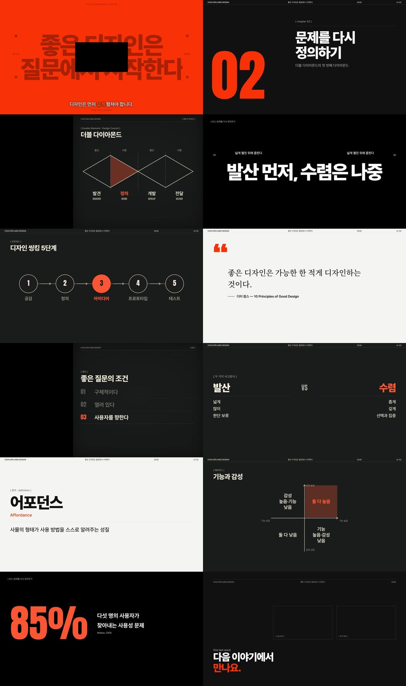
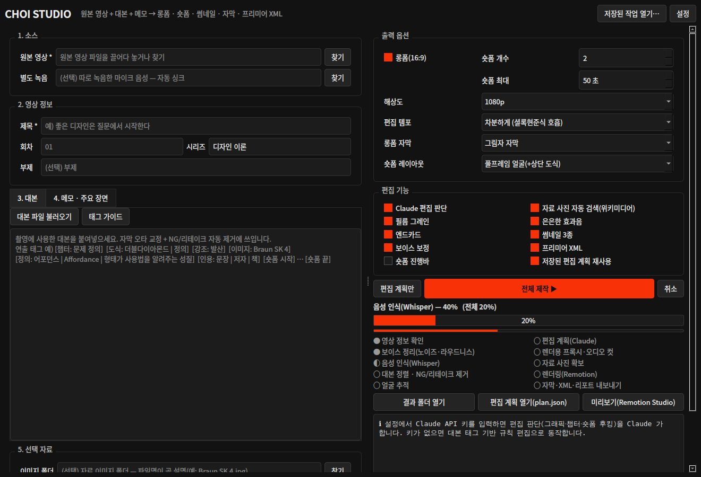

# Choi Studio — 디자인 이론 교육 영상 자동 편집기

**원본 토킹헤드 영상 + 대본 + 메모**를 넣으면, 오래 걸려도 끝까지 알아서
**롱폼(16:9) · 숏폼(9:16) · 썸네일 3종 · 자막(SRT) · 프리미어 XML · 업로드 정보 · 편집 리포트**를 만들어 주는 Windows 데스크톱 프로그램입니다.

- 편집 톤: **셜록현준**식 교양 토크(일상 → 질문 → 원리 → 개념 명명 → 일상 복귀), 칠판형 사이드 패널
- 비주얼: **Musicbed/Filmsupply 2026 Commercial Filmmaking Trend Report** 의 에디토리얼 문법(표지형 타이틀, 러닝 헤더, 초대형 타이포, 시그널 레드) — [docs/디자인_시스템.md](docs/디자인_시스템.md)
- 숏폼: 공개된 후킹·리텐션 연구와 크리에이터 노하우를 규칙으로 정리해 적용 — [docs/research/숏폼_후킹_리서치.md](docs/research/숏폼_후킹_리서치.md)
- **🎬 AI 스튜디오**: 총괄 감독 에이전트가 ✂️ 편집 · 🎨 모션 · 🎞 자료 · 🔤 자막 · 📱 숏폼 · ✍️ 카피 에이전트를 동시에 굴리고, 🧐 아트 디렉터가 렌더된 화면을 직접 보고 고칩니다 — [docs/AI_스튜디오.md](docs/AI_스튜디오.md)
- **모션 그래픽 자동 생성**(모션 DSL) + **Pexels 무료 스톡 영상·사진 자동 검색·선택** + **하이엔드 자막 프리셋**(에디토리얼·다큐·글래스·박스 / 키네틱·클린·박스)
- GitHub 디자인 스킬(motion-framer, animate-skill, video-editing-skill, Remotion 공식 스킬 등) 원칙을 에이전트에게 주입 — [docs/스킬_출처.md](docs/스킬_출처.md)

---

## 무엇을 자동으로 하나

| 단계 | 하는 일 | 사용 기술(오픈소스) |
|---|---|---|
| 보이스 정리 | 저역 컷 · 약한 노이즈 제거 · EQ · 디에서 · 컴프 · 2-pass 라우드니스(-16 LUFS). 따로 녹음한 마이크 음성은 **자동 싱크** | FFmpeg |
| 음성 인식 | 한국어 단어 단위 타임스탬프, 대본 속 전문용어를 힌트로 | faster-whisper(large-v3, CUDA) + Silero VAD |
| 대본 정렬 | 자막을 **대본 문장으로 교정**, 같은 구간을 여러 번 말하면 **마지막 테이크만** 남김, "아 다시 할게요" 같은 NG 발화 제거, 대본 태그를 실제 시간에 고정 | rapidfuzz + 글자 단위 정렬 |
| 무음 컷 | 템포 프리셋(차분하게/보통/빠르게). 차분하게 = 0.55초 넘는 쉼만 줄여 '생각하는 호흡' 유지 | Silero VAD |
| 얼굴 추적 | 줌인 중심, 칠판 패널에서 화자 열 위치, 9:16 세로 리프레이밍 | OpenCV YuNet (MIT) |
| 편집 판단 | **🎬 AI 스튜디오**: 총괄 감독의 브리프 → 전문 에이전트 6명 병렬(추가 컷·펀치인 / 도식·모션 장면 / 스톡 요청 / 자막 강조·프리셋 / 숏폼 훅 / 제목·설명란·썸네일 문구) | **Claude API**(구조화 출력, 프롬프트 캐시 공유) — 키가 없으면 대본 태그 기반 규칙 편집 |
| 모션 그래픽 | 템플릿으로 안 되는 개념(게슈탈트 근접성, 시선 흐름, 비례 변화 등)을 🎨 모션 디자이너가 **모션 DSL**(텍스트·도형·화살표·점 무리·카운터·막대, 키프레임)로 직접 설계 | Remotion + 검증기(`studio/motion/spec.py`) |
| 자료 사진 | 고유명사가 나오면 사진: ① 내 이미지 폴더(파일명 매칭) ② 위키미디어 커먼즈(자유 라이선스만, ▣ 출처 표기) | Wikimedia Commons API |
| 스톡 B-roll | 구체적 장면·사물은 **Pexels** 영상/사진 검색 → 후보 6개를 한 장의 시트로 묶어 Claude 가 **보고** 고름 → 1080p CFR 로 정리. 맞는 게 없으면 넣지 않음. 작가 크레딧 자동 표기 | Pexels API(무료 키) |
| 검수 | 🧐 아트 디렉터가 각 그래픽이 도착한 순간의 스틸과 자막 스틸을 보고 넘침·가독성·과밀을 지적 → 글자 줄이기·레이아웃 변경·삭제·모션 장면 재설계 | Claude 비전 |
| 그래픽·렌더 | 19종 템플릿, 칠판 패널/풀스크린/오버레이/PiP 레이아웃, 하이엔드 자막 프리셋, 2캠식 줌, BGM 덕킹, 은은한 효과음, 필름 그레인, 엔드카드 | **Remotion**(React) + FFmpeg(NVENC) |
| 내보내기 | 롱폼·숏폼 MP4, 썸네일 JPG 3종, SRT, Premiere Pro XML(원본 참조 컷 + 챕터/그래픽 마커), 업로드 정보, 편집 리포트 | |

### 그래픽 템플릿

챕터 카드 · 키워드 슬램 · 용어 정의 · 인용(명조) · 목록 · 단계 프로세스 · 순환 · **더블 다이아몬드** · 2x2 매트릭스 · 비교(A vs B) · 연표 · 숫자 · 벤 다이어그램 · 피라미드 · 자료 사진 · **모션 장면(직접 설계)** · **스톡 B-roll** · 오프닝 표지 · 로어서드 (+ 엔드카드, 숏폼 훅 타이틀)

### 자막 프리셋("그냥 자막"이 아닌 디자인된 자막)

| 롱폼 | 느낌 | 숏폼 | 느낌 |
|---|---|---|---|
| 에디토리얼(기본) | 배경 없는 흰 글자 + 부드러운 그림자, 줄 마스크 리빌 | 키네틱(기본) | 말하는 순간 단어가 마스크 안에서 올라옴 |
| 다큐멘터리 | 왼쪽 정렬 + 강조색 세로 룰(넷플릭스 다큐) | 클린 | 카라오케식(말한 단어만 밝게) |
| 글래스 | 반투명 유리 알약(애플 키노트) | 박스 | 활성 단어 뒤 강조색 알약 |
| 박스 | 잉크 박스 + 강조색 엣지(리포트) | | |

강조어는 🔤 자막 디자이너가 유형별로 고릅니다: **전문용어** = 형광 마커, **핵심어** = 밑줄 스윕, **숫자** = Anton 팝, **대비** = 외곽선. 한 줄에 하나만 쓰고, 조사("~라는", "~을")는 빼고 어간만 강조합니다. 화면에 도식이 떠 있으면 강조를 끕니다(강조색은 화면당 한 곳). 줄당 16자, 최대 2줄(넷플릭스 한국어 자막 기준).



---

## 설치 (Windows + NVIDIA, 처음 한 번)

1. 이 저장소를 내려받습니다(초록색 **Code → Download ZIP** 후 압축 해제, 또는 `git clone`).
   경로에 공백·한글이 없는 곳(예: `C:\ChoiStudio`)을 권장합니다.
2. **`setup_windows.bat`** 을 더블클릭합니다.
   - Python 3.12 · Node.js LTS · FFmpeg(Gyan, NVENC 포함)가 없으면 `winget` 으로 설치합니다. 새로 설치했다면 **창을 닫고 한 번 더 실행**하세요.
   - 파이썬 가상환경(.venv)과 패키지, GPU 음성인식용 cuBLAS/cuDNN, 렌더러(npm), 렌더용 Chrome 을 설치합니다.
   - 마지막에 Whisper large-v3 모델(약 3GB)을 미리 받을지 묻습니다.
3. **`run_studio.bat`** 을 더블클릭하면 창이 열립니다. (오류를 콘솔로 보려면 `run_studio_console.bat`)
4. 창 오른쪽 위 **설정 → AI** 에 키를 넣습니다.
   - **Claude API 키**(본인 키): [console.anthropic.com](https://console.anthropic.com) 에서 발급. 키가 없어도 동작하지만(대본 태그 기반), AI 스튜디오·모션 장면·검수는 키가 있어야 합니다.
   - **Pexels API 키**(무료): [pexels.com/ko-kr/api](https://www.pexels.com/ko-kr/api/) 에서 발급. 스톡 영상·사진 자동 검색에 씁니다.
   - 키는 이 PC 의 `user/settings.json` 에만 저장됩니다.

> NVIDIA 드라이버는 최신으로 유지하세요. GPU 가 인식되지 않으면 자동으로 CPU 로 전환됩니다(느리지만 동작).

## 사용법



1. **원본 영상**을 끌어다 놓습니다. 마이크를 따로 녹음했다면 **별도 녹음**에 넣으세요(자동 싱크).
2. **제목**, 회차를 입력합니다.
3. **대본** 탭에 촬영 대본을 붙여넣습니다. 연출을 확실히 지정하고 싶은 곳에 태그를 답니다 → [대본 태그 가이드](docs/대본_태그_가이드.md)
   ```
   # 문제를 다시 정의하기
   [도식: 더블다이아몬드 | 정의] 문제를 정의하기 전에 해결책부터 그리거든요.
   [이미지: Braun SK 4] 1956년 디터 람스가 디자인한 이 라디오를 보면…
   ```
4. **메모 · 주요 장면** 탭에 주제, 강조하고 싶은 장면(원본 시각 "03:20" 처럼 적어도 됨), 참고 도서, 숏폼으로 만들고 싶은 부분을 자유롭게 적습니다.
5. (선택) **편집 지시** 탭: AI 스튜디오 전체에 주는 지시(예: "모션 그래픽 많이, 스톡은 자연광 톤만").
6. (선택) 자료 이미지 폴더 · BGM(라이선스 있는 곡) · LUT(.cube).
7. 오른쪽 **🎬 AI 스튜디오** 상자에서 멀티 에이전트 · Pexels 스톡 · 모션 장면 · 아트 디렉터 검수 라운드를 고르고, **출력 옵션**에서 자막 프리셋(자동 = 🔤 자막 디자이너가 선택)을 고릅니다.
8. **전체 제작 ▶**. 끝나면 `결과 폴더 열기`.

### 결과 폴더(`projects/날짜_제목/output/`)

| 파일 | 내용 |
|---|---|
| `제목_롱폼.mp4` | 16:9 완성본 |
| `제목_숏폼1_….mp4` … | 9:16 숏폼(상단 훅 타이틀 + 큰 자막 + 필요한 곳에 상단 도식) |
| `제목_썸네일1_signal.jpg` 등 3종 | 얼굴이 잘 나온 프레임 + Claude 가 제안한 문구 |
| `제목_롱폼.srt`, `제목_숏폼1.srt` | 유튜브 CC 업로드용 자막 |
| `제목_롱폼_premiere.xml` | Premiere Pro: 파일 → 가져오기. 원본 영상 컷 + 정리된 보이스 + 챕터/그래픽 마커 |
| `제목_업로드정보.txt` | 제목 후보 5개, 설명란(챕터 타임코드 포함), 태그, 썸네일 문구, 고정 댓글, 음악 무드, 숏폼 캡션·해시태그 |
| `제목_편집리포트.md` | 🎬 스튜디오 브리프(로그라인·비트), 🧐 검수 기록, 잘라낸 발화(이유 포함), 대본에서 빠진 문장, 그래픽 목록, 숏폼 선정 이유, 사진·스톡 출처, 에이전트별 Claude 사용량 |
| `plan.json` | 편집 계획(아래 참고) |

### 계획을 고쳐서 다시 렌더하기 (80% 자동 + 20% 손질)

1. **편집 계획만** 버튼 → 음성 인식·정렬·Claude 판단까지만 하고 멈춥니다.
2. **편집 계획 열기(plan.json)** → 그래픽 문구, 챕터 제목, 숏폼 훅 타이틀 등을 고쳐 저장합니다(발화 ID `start_seg` 는 편집 리포트/`work/align.json` 참고).
3. **전체 제작 ▶** → 음성 인식·프록시는 캐시를 쓰고, 고친 계획으로 렌더만 다시 합니다(Claude 재호출 없음).
4. **미리보기(Remotion Studio)** 로 브라우저에서 타임라인을 훑어볼 수 있습니다.

## 시간과 비용

- 15분 원본(4K) 기준 대략: 음성 인식 3~6분(RTX 계열 GPU) · 프록시 2~4분(NVENC) · 렌더 10~25분(롱폼) + 숏폼·썸네일 몇 분. 오래 걸려도 끝까지 자동입니다.
- Claude(기본 `claude-opus-5-5`):
  - **AI 스튜디오**: 감독 1회 + 전문가 6회(병렬) + 스톡 선택 1회 + 검수 1~2회(+모션 수정). 모든 호출이 같은 시스템 프롬프트·전사본 캐시를 공유해서 입력 비용이 크게 줄어듭니다. 에이전트별 사용량은 편집 리포트에 표로 남습니다. 단일 디렉터 모드(2회 호출)보다 몇 배 비쌉니다.
  - **단일 디렉터 모드**(AI 스튜디오 끄기): 롱폼 계획 + 숏폼 기획 두 번 호출.
  - 설정에서 `claude-sonnet-5-5` 로 바꾸거나, `user/settings.json` 의 `agent_models`/`agent_effort` 로 에이전트별로 낮출 수 있습니다.
  - 거절(refusal) 시 서버측 자동 폴백(`fallbacks: "default"`)을 켜 두었습니다.
- Pexels 는 무료입니다(시간당 200회·월 2만 회, 검색 결과는 캐시). 위키미디어·로컬 처리 비용은 없습니다.

## 작동 구조

```
원본 영상 ─┬─ FFmpeg: 보이스 정리/싱크 ── faster-whisper(단어 타임스탬프) ── 대본 정렬(NG·리테이크 제거, 태그 고정)
          │                                                               │
          ├─ YuNet 얼굴 추적 ─────────────────────────────┐                ▼
          │                                             │      Claude 편집 감독(구조화 JSON)
          └─ FFmpeg(NVENC): CFR 프록시 ─┐                 │      · 롱폼: 챕터/그래픽/강조/컷/메타데이터
                                      │                 │      · 숏폼: 구간/훅 유형/콜드오픈/타이틀
                                      ▼                 ▼                │
                         Remotion(React) 렌더: 프레임 단위 컷 + 카메라 + 레이아웃 + 템플릿 + 자막 + 오디오
                                      │
                                      ▼
                  MP4 · 썸네일 · SRT · Premiere XML · 업로드 정보 · 리포트
```

- 영상 컷은 Remotion 이 CFR 프록시에서 **프레임 단위로 직접** 가져오고, 음성은 샘플 단위로 잘라 붙여 싱크가 누적해서 밀리지 않습니다.
- 각 단계 결과는 `projects/…/work/` 에 캐시되어 다시 실행하면 바뀐 단계부터 진행합니다.

| 폴더 | 내용 |
|---|---|
| `studio/` | 파이썬 파이프라인·GUI (`python -m studio`) |
| `studio/director/` | Claude 호출, 스키마, 규칙 기반 디렉터, 템플릿 카탈로그 |
| `studio/agents/` | 🎬 AI 스튜디오(감독 → 병렬 전문가 → 합치기, 스톡 선택, 아트 디렉터 검수) |
| `studio/stock/` | Pexels 클라이언트, 후보 시트·선택·다운로드·정리 |
| `studio/motion/` | 모션 DSL 검증기 |
| `prompts/` | 스튜디오 헌장·에이전트 지시문·스타일/후킹 가이드·모션 DSL·디자인 스킬 노트 — 채널 톤을 바꾸려면 여기를 고치세요 |
| `.claude/skills/` | 포함한 오픈소스 디자인 스킬(MIT) — [docs/스킬_출처.md](docs/스킬_출처.md) |
| `renderer/` | Remotion 프로젝트(디자인 시스템·템플릿·컴포지션) |
| `docs/` | 사용 가이드, 디자인 시스템, 리서치 원문 |
| `models/` | YuNet 얼굴 검출 모델(MIT) |
| `tests/` | 단위 테스트, GPU 없이 도는 E2E 스모크 테스트 |

## 문제 해결

| 증상 | 해결 |
|---|---|
| `cublas64_12.dll` / `cudnn` 관련 오류 | `setup_windows.bat` 재실행(cuBLAS/cuDNN 설치) 또는 설정 → Whisper 장치 `cpu` |
| `ffmpeg 를 찾을 수 없습니다` | `winget install Gyan.FFmpeg` 후 새 창에서 실행, 또는 설정에 ffmpeg.exe 경로 입력 |
| 렌더 중 Chrome 관련 오류 | `renderer` 폴더에서 `npx remotion browser ensure` |
| 아이폰 HDR 영상 색이 이상함 | 자동 톤매핑(HLG/PQ → SDR)을 합니다. 그래도 이상하면 LUT 를 지정하세요 |
| 자막 용어가 계속 틀림 | 설정 → 용어 사전에 `틀린말=맞는말` 추가, 대본을 넣으면 대본 표기를 따릅니다 |
| 자료 사진이 엉뚱함 | 이미지 폴더에 원하는 사진을 `검색어.jpg` 로 넣으면 그것을 우선 사용 |
| 위키미디어 접속 실패 | 사진 없이 진행됩니다(리포트에 표시). 회사/학교망에서 막혔을 수 있습니다 |
| 스톡 B-roll 이 안 들어감 | 설정에 Pexels 키가 있는지, 🎞 체크가 켜져 있는지 확인. 맞는 후보가 없으면 일부러 넣지 않습니다(리포트의 🎞 로그) |
| `429`/요청 한도 오류 | 설정 → 동시 에이전트 수를 2로 줄이세요 |
| 검수가 너무 오래 걸림 | 🧐 검수 라운드를 1 또는 끔으로 |

## 라이선스·저작권 메모

- 코드: 이 저장소.
- **Remotion** 은 개인·3인 이하 회사는 무료, 그 이상은 회사 라이선스가 필요합니다(remotion.dev/license).
- 폰트: Pretendard, Anton, Noto Serif KR — SIL Open Font License.
- 얼굴 검출: OpenCV Zoo YuNet — MIT (`models/LICENSE_YUNET.txt`).
- 위키미디어 사진은 CC0/퍼블릭 도메인/CC BY/CC BY-SA 만 쓰고 화면과 설명란에 출처를 넣습니다. CC BY-SA 는 조건을 리포트에서 확인하세요.
- Pexels 영상·사진은 Pexels 라이선스(무료, 출처 표기 권장)를 따르며 화면 ▣ 와 설명란에 작가 크레딧을 자동으로 넣습니다. 알아볼 수 있는 인물·상표가 크게 나오는 컷은 피하도록 지시했지만 최종 확인은 직접 하세요.
- `.claude/skills/` 의 스킬은 각 폴더의 MIT 라이선스를 따릅니다.
- **BGM 은 직접 라이선스를 받은 곡**을 넣어야 합니다(Musicbed, Artlist, YouTube 오디오 보관함 등).

## 개발

```bash
python -m pytest tests -q                     # 단위 테스트
python tests/e2e_synthetic.py --browser <chrome>  # 합성 영상으로 전체 파이프라인(음성 인식은 가짜 결과)
python tests/e2e_studio.py --browser <chrome>     # 가짜 Claude·Pexels 서버로 AI 스튜디오 전체(에이전트·스톡·검수)
cd renderer && npm run studio                 # 템플릿 디자인 미리보기(src/samples.ts)
python -m studio run --video a.mp4 --title "제목" --script 대본.txt --notes 메모.txt   # CLI
```
